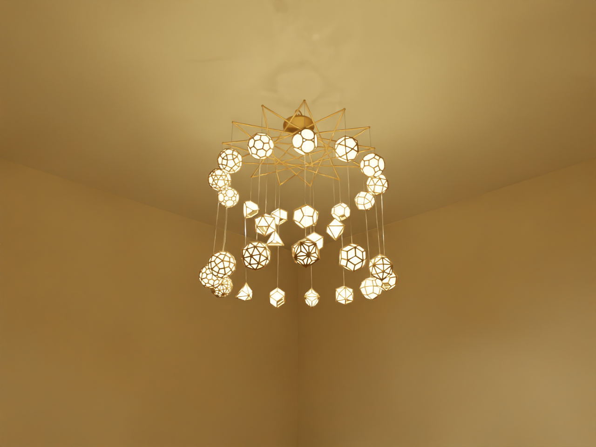

# weird_objects

Experiments in geometric / mathematical 3D objects and their physical
manufacture. Each subfolder is a self-contained little project; they
share a single Python `.venv` and a shared `polyhedra.py` library at
the repo root.

The headline project is the [**31-polyhedron chandelier**](chandelier/)
designed for cast aluminium + frosted acrylic + LED COB modules.



## Projects

| Folder | What it is |
|---|---|
| [`chandelier/`](chandelier/) | All five Platonic + 13 Archimedean + 13 Catalan solids on three concentric rings, fused into one watertight cast-aluminium STL with frosted-acrylic panels and 31 interior LEDs |
| [`starlight_lantern/`](starlight_lantern/) | Investment-cast tealight lantern that projects a starfield on the floor when lit, with a Monte-Carlo shadow validator |
| [`candle_holder/`](candle_holder/) | Spiral-shadow candle holder design |
| [`gyroid_sphere/`](gyroid_sphere/) | Graded-density gyroid spheres extracted via marching cubes |
| [`ice_tray/`](ice_tray/) | Parametric icosahedron-cell ice tray |
| [`constellation/`](constellation/) | 14-node polyhedral constellation (Platonic + Archimedean + Catalan icosahedral family) |

Each project's folder has its own `README.md` with usage details and
images. Top-level shared infrastructure:

```
weird_objects/
├── polyhedra.py          shared geometry library (verts/edges/faces of
│                         every Platonic, Archimedean, and Catalan solid)
├── test_polyhedra.py     pytest unit tests for `polyhedra.py`
├── requirements.txt      Python dependencies
├── run.sh                venv-managed script runner; resolves
│                         <project>/<script>.py paths and sets PYTHONPATH
├── run_tests.sh          pytest runner using the same shared venv
└── .gitignore            ignores all generated *.stl / *.ply / *.dxf
                          plus .venv / panels.json / blender_assets / etc.
```

## Quick start

```bash
# 1. Build the chandelier STL (~ 1 minute, ~ 800 K faces, watertight)
./run.sh chandelier/all_polyhedra.py

# 2. Generate the 1029 panel outlines for laser-cutting acrylic
./run.sh chandelier/make_panel_outlines.py

# 3. Photoreal Cycles render of the chandelier in a room
./chandelier/render_blender.sh                    # daylit showroom default
./chandelier/render_blender.sh --projection       # moody dark-room with wall projection

# 4. Quick interactive PyVista preview (no Blender needed)
./run.sh chandelier/simulate_chandelier.py
```

`./run.sh` creates a single `.venv/` at the repo root, installs
`requirements.txt` once, then forwards arguments to whichever script you
hand it. It accepts paths relative to the repo root (`chandelier/foo.py`),
absolute paths, or bare script names (e.g. `./run.sh shadow_preview.py`).

## Manufacturing notes (chandelier)

The chandelier is designed end-to-end to be manufacturable as cast
aluminium (A356-T6, investment cast) with laser-cut 1.6 mm
(1/16″) cast-acrylic panels held in 2 mm × 2 mm slots cut into the
edge rods. Approximate spec:

- Envelope: 1067 × 1213 × 1061 mm (≈ 42 × 48 × 42 in)
- Mass:     ≈ 16.7 kg / 37 lbs (aluminium frame only)
- LEDs:     31 × 12 V COB modules, ≤ 3 W each, driven from a single
            driver in the canopy
- Acrylic:  1029 captured panels, one per face except one open access
            face per polyhedron (also serves as a downlight aperture)

See [`chandelier/ASSEMBLY.md`](chandelier/ASSEMBLY.md) for the full
process from foundry quote to final hanging.

## Dependencies

Python 3.10+, plus the `requirements.txt` packages. For Blender renders
you also need [Blender](https://www.blender.org/download/) 4.x or 5.x:

```bash
brew install --cask blender
```

## License

Personal exploration — no license declared yet. Open an issue if
you'd like to use any of this.
