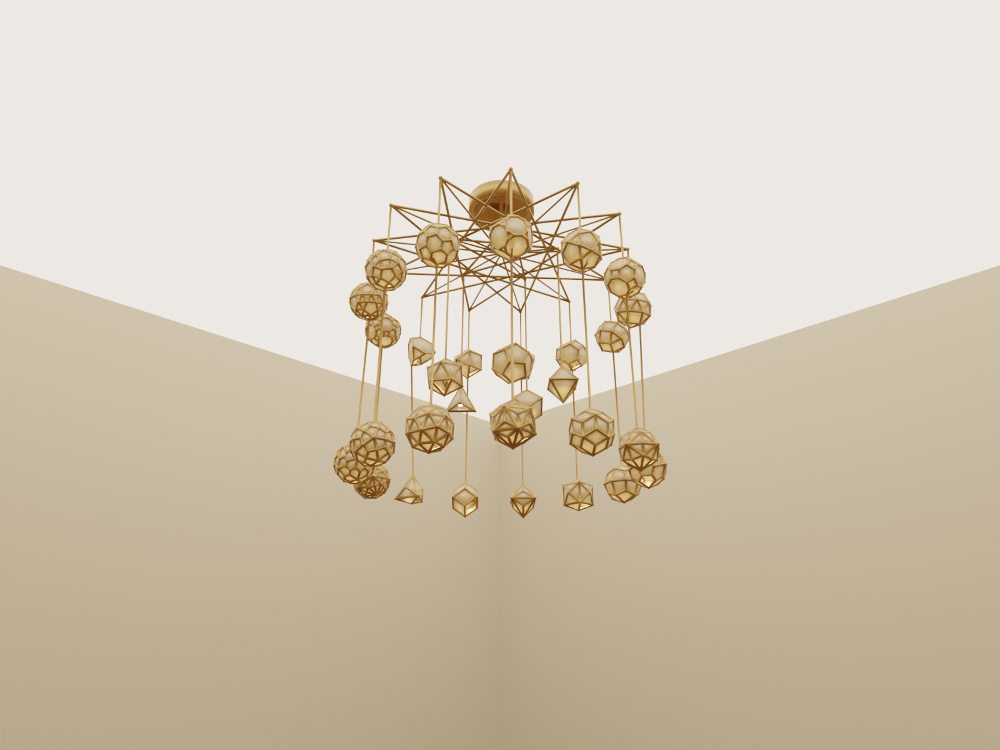
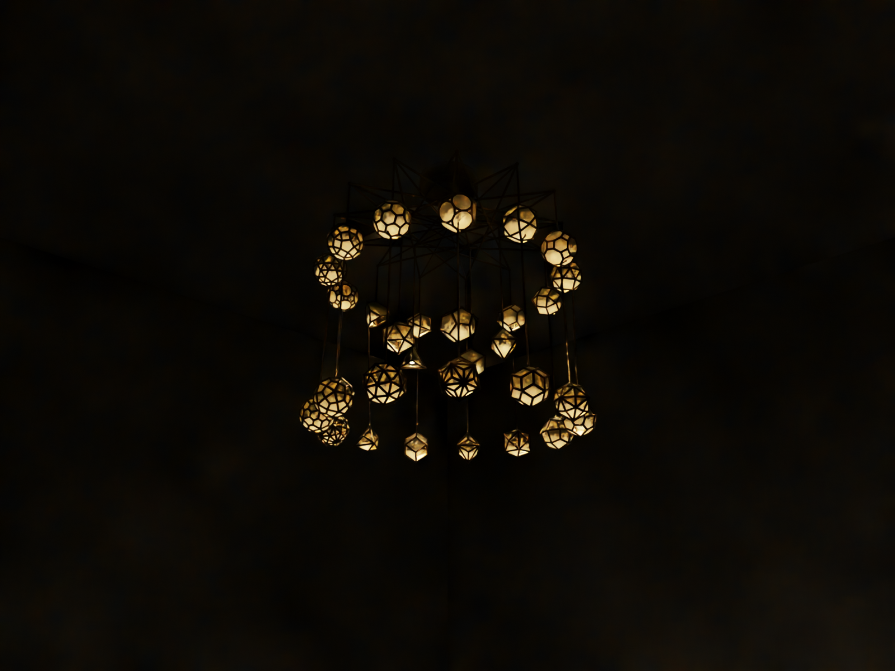
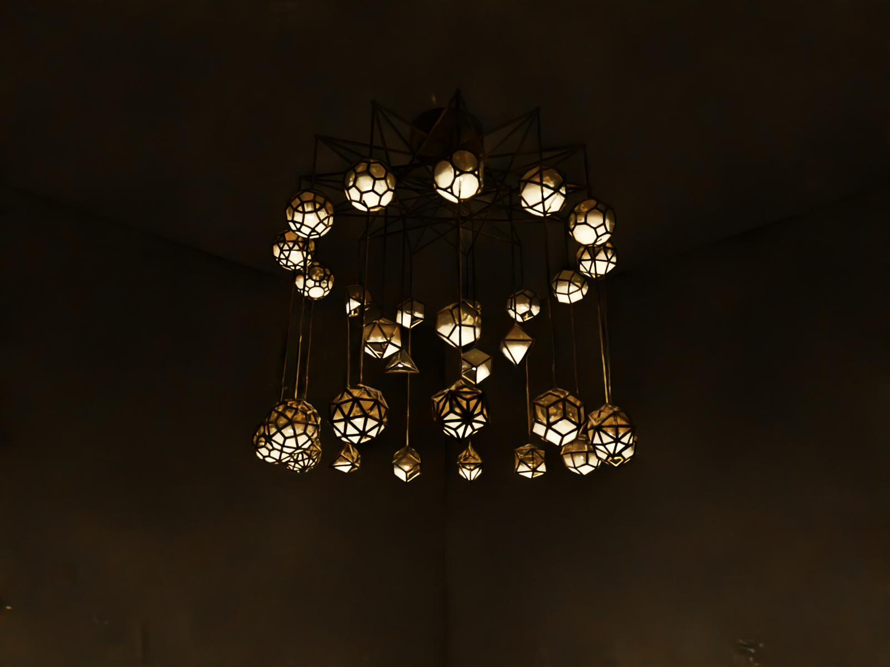

# Chandelier — 31 polyhedra in cast aluminium + frosted acrylic

All five Platonic solids, all 13 Archimedean solids, and all 13 Catalan
solids hang from three concentric rings. Each Catalan dual is positioned
directly below its Archimedean parent so the dual pairing is visible at
a glance. Every polyhedron is a wireframe of cast metal with frosted
acrylic panels captured in slots cut into the edge rods, and an
interior 12 V COB LED that lights the panels from within.

| Showroom (open ceiling, ambient) | Night (sealed room) | Projection (moody, walls lit) |
|---|---|---|
|  |  |  |

## Files

| File | Purpose |
|---|---|
| `all_polyhedra.py` | Master script that builds the watertight cast-aluminium STL: 31 polyhedra + hub spider + hangers + canopy + eye loop. Reports mass / aluminium volume. |
| `simulate_chandelier.py` | PyVista interactive viewer with glowing LEDs and translucent panels (fast preview); also exports `panels.ply` + `led_positions.json` for Blender via `--export-blender DIR`. |
| `render_blender.py` | Cycles-driven photoreal renderer (run via `render_blender.sh`). Handles materials, room geometry, LED point lights, and camera. |
| `render_blender.sh` | Wrapper that locates Blender, builds Blender assets, and dispatches the render. Run from anywhere. |
| `make_panel_outlines.py` | Reproduces the chandelier's vertex layout in 2-D and writes a DXF + JSON of every laser-cut acrylic panel (one per face except the open access face). |
| `make_drill_jigs.py` | Generates per-part drill jigs for the canopy and star plate. |
| `split_polyhedra.py` | Splits the assembled chandelier STL into per-polyhedron STLs for individual review or per-piece foundry quoting. |
| `ASSEMBLY.md` | Step-by-step assembly + sourcing guide: foundry → finish → wiring → panel install → hanging. |
| `ASSEMBLY_full_cast.md` | Variant assembly guide for an all-cast (no laser-cut sub-frame) approach. |
| `shopping_list.csv`, `shopping_list_with_urls.csv` | Bill of materials. |
| `renders/` | Committed example renders (showroom, night, projection, PyVista preview). |
| `blender_assets/` | (gitignored) Cached `panels.ply` and `led_positions.json` produced by `simulate_chandelier.py --export-blender` for the Blender renderer. |
| `polyhedra_stl/` | (gitignored) Per-polyhedron STLs produced by `split_polyhedra.py`. |
| `jigs/` | (gitignored) Drill-jig STLs produced by `make_drill_jigs.py`. |

The shared `polyhedra.py` library at the repo root and its tests
(`test_polyhedra.py`) live one directory up — they're shared with
`ice_tray/` and `constellation/` too.

## Build

```bash
# From the repo root
./run.sh chandelier/all_polyhedra.py
# -> chandelier/all_polyhedra_31.stl  +  chandelier_metal_core.stl
#                                      +  chandelier_metal_minimal.stl

./run.sh chandelier/make_panel_outlines.py
# -> chandelier/panels.dxf  +  chandelier/panels.json    (1029 panels)

./run.sh chandelier/split_polyhedra.py
# -> chandelier/polyhedra_stl/*.stl     (33 individual polyhedron STLs)

./run.sh chandelier/make_drill_jigs.py
# -> chandelier/jigs/*.stl              (canopy + star drilling jigs)
```

## Render in Blender (Cycles)

Requires [Blender](https://www.blender.org/download/) 4.x or 5.x.
Install on macOS with `brew install --cask blender`.

```bash
./chandelier/render_blender.sh                    # default daylit showroom
./chandelier/render_blender.sh --projection       # moody dark-room with wall projection
./chandelier/render_blender.sh --sealed-ceiling --led-watts 500 \
                               --exposure 4 --ambient 0.05 \
                               --out renders/night.png
./chandelier/render_blender.sh --device METAL --samples 512   # GPU + high quality
```

Tunable args include `--led-watts`, `--led-color`, `--metal-color`,
`--panel-color`, `--panel-clarity`, `--panel-frostiness`,
`--shadow-softness`, `--exposure`, `--ambient`, `--room-width`,
`--room-height`, `--camera-height`. Run with `--help` for the full list.

## Interactive preview (PyVista)

```bash
./run.sh chandelier/simulate_chandelier.py
```

Opens an interactive 3D viewer with glowing LEDs and translucent panels.
Pass `--screenshot foo.png` to render off-screen and exit.

## Manufacturing spec

- Envelope: 1067 × 1213 × 1061 mm (≈ 42 × 48 × 42 in)
- Mass:     ≈ 16.7 kg / 37 lbs (aluminium frame only)
- Process:  Investment-cast A356-T6 aluminium frame (1.10 mm pre-scale
            edge rod radius → ≈ 7.9 mm post-scale OD; min wall comfortable
            for the foundry process)
- Acrylic:  1029 cast-acrylic panels, 1.6 mm thick (1/16″), captured in
            0.55 × 0.55 mm pre-scale (≈ 2 × 2 mm post-scale) slots
- Wiring:   Drilled internal channels through every Archimedean's
            internal trunk and through each polyhedron's top vertex
            node; U-grooves on the underside of every external carrier
            so wires snap in invisibly
- LEDs:     31 × 12 V COB modules, ≤ 3 W each, driven from one
            constant-voltage driver hidden in the canopy

See [`ASSEMBLY.md`](ASSEMBLY.md) for the full assembly walk-through.
