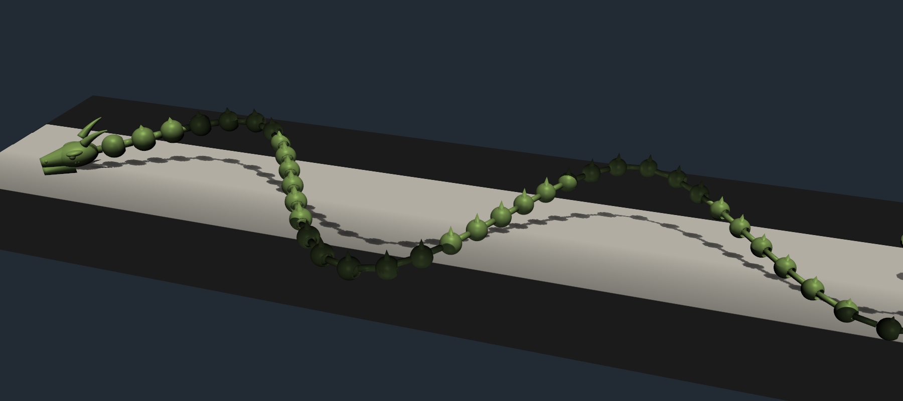
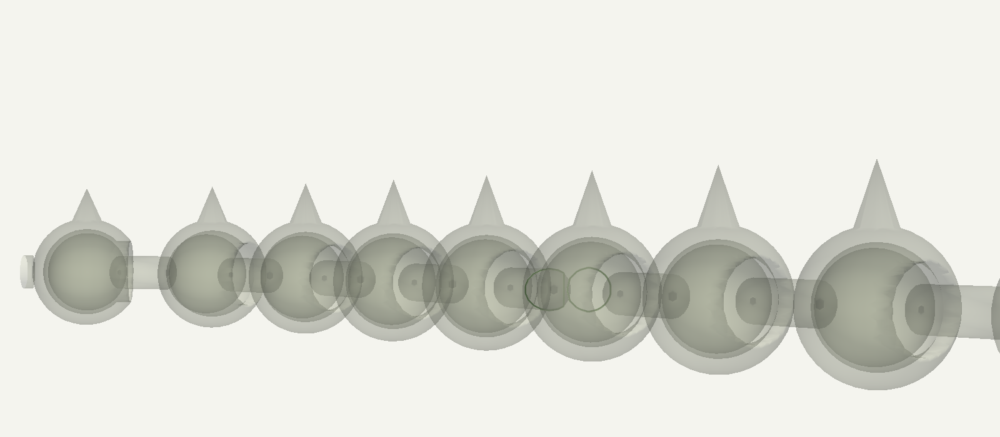

# Extra-Long Articulated Dragon

A procedurally-generated, **extra-long, print-in-place flexi dragon** with
ball-and-socket joints between every body segment, inspired by popular flexi
designs (Cinderwing's Crystal Dragon, McGybeer's Articulated Dragon) and
articulated snakes (DanielAlex's Articulated Snake, Crazy3D's Ultra
Articulated Snake).



The chain has **40 articulated segments** for ~600 mm of total length and
prints **flat in the XY plane** with no supports needed.  Each ball is
captured inside the previous segment's socket cavity through an opening that
is intentionally smaller than the ball, so they can never escape after
printing.

## How it's articulated

Every segment is built in a local frame as:

```
    head <-- [ball]==[neck]==[ socket-bulb (cavity inside) ] --> tail
            -pitch/2     0                +pitch/2
```

Adjacent segments line up so segment N+1's ball sits at the center of segment
N's socket cavity, with a 0.45 mm radial clearance and a captured opening:



In the cross-section above you can see, repeating along the chain:
- the large **socket bulb** (one per segment) with a hollow cavity
- the next segment's **ball** trapped inside that cavity
- a thin **neck cylinder** linking each segment's ball to its socket bulb
- the **dorsal spikes** unioned to the top of each socket bulb

## Joint design parameters

Following the consensus from popular flexi designs:

| Parameter             | Value                       | Why                                                       |
|-----------------------|-----------------------------|-----------------------------------------------------------|
| `CLEARANCE`           | 0.45 mm                     | Radial gap between ball and socket cavity (0.3-0.5 mm typical) |
| `CAPTURE_FRAC`        | 0.22                        | Opening radius = `r_ball * (1 - 0.22)` so it captures the ball |
| `WALL_THICK`          | 1.55 mm                     | Socket outer wall thickness                               |
| `NECK_RATIO`          | 0.42                        | Body cylinder radius = `r_ball * 0.42` (must fit through opening) |
| `PITCH`               | derived (~21.8 mm)          | Must be > `2 * outer_socket_radius + 0.4` to keep adjacent bulbs apart |

These give roughly **20-25 deg of bend per joint** in any direction — with
40 segments that's **well over a full coil** of total flexibility.

The script asserts that `PITCH > 2 * r_outer + 0.4` at startup so you cannot
accidentally generate a fused chain by mis-tuning parameters.

## Recommended print settings

(Same as other popular flexi prints.)

- **Layer height**: 0.16-0.2 mm
- **Print speed**: 40-50 mm/s
- **Flow rate**: 95-100 % (over-extrusion is the #1 cause of fused joints)
- **No supports** anywhere
- A brim helps with first-layer adhesion since each segment touches the bed
  at a small contact patch
- After printing: gently flex side-to-side to free any micro-bridging - do NOT
  rotate the joints first

## Files

| File                       | Purpose                                                          |
|----------------------------|------------------------------------------------------------------|
| `extra_long_dragon.py`     | Generator script (writes `stl/extra_long_dragon.stl`)            |
| `render_preview.py`        | Renders the three preview PNGs using PyVista                     |
| `stl/extra_long_dragon.stl`| Output mesh - 40 articulated solids in one file                  |
| `preview.png`              | Top-down view of the entire chain                                |
| `preview_iso.png`          | 3/4 isometric view (shown at top)                                |
| `preview_joint.png`        | True cross-section through several joints                        |

## Tunables (top of `extra_long_dragon.py`)

| Parameter        | Effect                                            |
|------------------|---------------------------------------------------|
| `N_SEGMENTS`     | Number of articulated body segments (40)          |
| `X_LEN_TARGET`   | Base X extent of the spine in mm (560)            |
| `SERPENT_AMP`    | XY serpentine amplitude (85)                      |
| `SERPENT_WAVES`  | Number of full S-waves along the spine (1.8)      |
| `R_BALL_HEAD`    | Ball radius at head end (6.0)                     |
| `R_BALL_TAIL`    | Ball radius at tail end (3.8)                     |
| `CLEARANCE`      | Joint clearance in mm (0.45)                      |
| `CAPTURE_FRAC`   | Opening narrowness (0.22)                         |
| `WALL_THICK`     | Socket wall thickness (1.55)                      |

To make it even longer, bump `N_SEGMENTS` and `X_LEN_TARGET` together so
`PITCH` stays above the auto-checked minimum.

## Usage

```bash
python dragon/extra_long_dragon.py    # generates the STL
python dragon/render_preview.py        # optional: renders preview.png etc.
```

## Printing

At ~600 mm long the dragon won't fit on a 256 mm Bambu/Prusa bed.  Options:

1. **Scale down** in the slicer (a 35-50 % scale prints comfortably and looks
   great).  Note that scaling shrinks the joint clearance proportionally - go
   no smaller than ~50 % unless you can compensate.
2. **Cut the STL into chunks** along X every ~10 segments, print each, then
   re-thread the joints by inserting the dangling ball of one chunk into the
   open socket of the next (this works because each chunk's chain is just a
   smaller version of the same design).

## Caveats

- This is a generator, not a manually tuned production model.  Joint behavior
  depends on your printer's tolerance.  Print one or two test segments first
  if you're unsure, or scale down the asserted `CLEARANCE` to 0.5 mm if your
  printer over-extrudes.
- Multi-piece STLs sometimes confuse slicers - if so, slice the dragon in
  PrusaSlicer/OrcaSlicer/Bambu Studio with **"Treat as multi-volume part"**
  enabled (or equivalent) so each segment is recognized as its own object.
