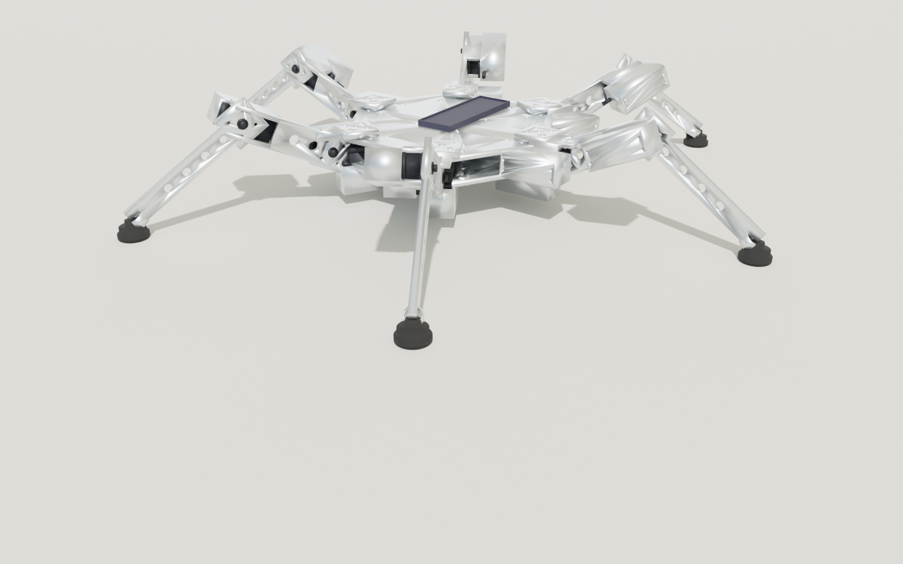

# Human-Carrying Hexapod Walker

A parametric STL generator for a **human-rider-sized six-legged walking
vehicle.** One Python script (`hexapod_walker.py`) emits 11 individual
STL parts plus an assembly-preview STL of the whole vehicle in standing
pose. A second script (`build_full_assembly.py`) emits a fully-dressed
assembly — frame, 18 motor housings, battery + cells, foot rubber,
saddle padding, and a stylized seated rider — split into 5 category
STLs that the Blender render script materials separately.

* Vehicle envelope: ~ 4.0 m foot-to-foot, ~ 1.3 m saddle height
* Payload: 1 rider, ≤ 110 kg
* 18 actuators (3 DOF × 6 legs), driven by industrial harmonic-drive servos
* Total dry mass ~ 280 kg
* See [`ASSEMBLY.md`](ASSEMBLY.md) for the full build guide, BOM, motor
  selection, electronics, gait, and safety notes.


> **Looking for a cheap way to prove the kinematics first?**
> See the [tabletop prototype](#tabletop-prototype) section below for a
> ~ 60 cm, ~ 1.3 kg sibling design that runs on $13 hobby servos and
> 3D-printed PLA — same architecture, same gait, ~ $200 BOM, walks in
> a weekend. Full guide: [`PROTOTYPE.md`](PROTOTYPE.md).

## Quick start

```bash
# from the repo root
./run.sh hexapod_walker/hexapod_walker.py        # 11 fabricable STLs
./run.sh hexapod_walker/build_full_assembly.py   # full-assembly category STLs
./hexapod_walker/render_blender.sh \              # photoreal Cycles render
    --device METAL --samples 256 \
    --out hexapod_walker/renders/walker_hero.png
```

## Generate the fabricable STLs

```bash
./run.sh hexapod_walker/hexapod_walker.py
```

This creates `hexapod_walker/stl/` containing:

| File | Qty for one vehicle | Recommended fabrication |
|---|---|---|
| `chassis_hex.stl` | 1 | Welded 80 × 80 × 6 mm sq. tube + plate, painted |
| `chassis_top_deck.stl` | 1 | 12 mm 6061-T6, CNC water-jet |
| `saddle_mount.stl` | 1 | CNC 6061-T6 or MJF PA12-CF |
| `battery_box.stl` | 1 | MJF PA12-CF or welded 3 mm aluminum |
| `electronics_bay.stl` | 1 | MJF PA12-CF |
| `coxa_bracket.stl` | 6 | CNC 6061-T6 or investment-cast A356 |
| `coxa_link.stl` | 6 | CNC 6061-T6 or investment-cast A356 |
| `femur_link.stl` | 6 | CNC end caps on a 90 × 120 × 6 mm Al extrusion |
| `tibia_link.stl` | 6 | CNC end caps on a 70 × 90 × 5 mm Al extrusion |
| `foot_pad.stl` | 6 (used as mould patterns) | 60-A urethane around a 6 mm steel disc |
| `motor_flange.stl` | 18 | MJF PA12-CF or CNC 6061-T6 |
| `assembly_preview.stl` | 0 (visualization only) | Open in MeshLab / Cursor STL viewer |

All 11 individual parts are watertight manifolds and load directly into
slicers and CAM software. The assembly preview is a visualisation
aggregate (overlapping parts, not booleaned) — don't try to slice it.

## Generate the full assembly + render

`build_full_assembly.py` emits a *visual* assembly that includes
everything you'd need to ship a finished walker — not just the
fabricable parts:

```bash
./run.sh hexapod_walker/build_full_assembly.py
```

This writes 6 STL files into `assembly/`:

| File | Contents | Material in render |
|---|---|---|
| `frame.stl`   | Chassis + top deck + 6 × {coxa bracket, coxa link, femur, tibia} + saddle post + handlebars + electronics bay | Brushed satin aluminum |
| `motors.stl`  | 18 × harmonic-drive servo housings (with cooling fins, output flanges, encoder caps) at every joint | Dark anodized aluminum |
| `battery.stl` | Battery enclosure + 2 × visible LiFePO₄ cell packs | Matte black powder-coat |
| `soft.stl`    | Urethane foot pads + saddle pad + saddle backrest + handlebar grips | Black rubber / leather |
| `rider.stl`   | Stylized 1.75 m seated rider (head, torso, arms gripping bars, legs on footrests) — for scale | Denim grey |
| `full.stl`    | All five categories merged into one mesh — drop-in for non-Blender STL viewers | n/a |

Then run the Blender render (Cycles, denoised):

```bash
./hexapod_walker/render_blender.sh                                # default
./hexapod_walker/render_blender.sh --device METAL --samples 256   # GPU + nicer
./hexapod_walker/render_blender.sh --camera-azimuth-deg 90        # side view
```

The wrapper auto-locates Blender, rebuilds the assembly STLs if any are
missing or stale, and runs `render_blender.py` headless. Default output
is `renders/walker.png` (1600 × 1000); a typical Cycles render on Apple
Silicon's `METAL` backend takes ~ 10 s at 96 samples or ~ 30 s at 256.

## Customising the design

Every dimension is a named constant near the top of
[`hexapod_walker.py`](hexapod_walker.py). The most useful knobs:

| Constant | Default | Tweak this if... |
|---|---|---|
| `CHASSIS_FLAT_TO_FLAT` | 1200 mm | You want a wider/narrower body |
| `COXA_LENGTH` | 150 mm | Hip-yaw axis ↔ hip-pitch axis offset |
| `FEMUR_LENGTH` | 600 mm | Thigh length |
| `TIBIA_LENGTH` | 800 mm | Shin length |
| `MOTOR_OD`, `MOTOR_BOLT_CIRCLE`, `MOTOR_LENGTH` | matched to Harmonic Drive FHA-40C | Your chosen servomotor has a different flange |
| `STANCE_FEMUR_DEG`, `STANCE_TIBIA_DEG` | -25°, +60° | Different ride height in the preview |

After editing, re-run `./run.sh hexapod_walker/hexapod_walker.py` —
expect ~ 1.5 s for a full regeneration.

## MuJoCo physics simulation

The MJCF model in [`mujoco_walker.py`](mujoco_walker.py) wires the existing
STL parts into a fully dynamic six-legged robot: chassis + saddled rider
(visual only — its mass is lumped into the chassis), 18 hinge joints (yaw,
hip pitch, knee per leg) driven by industrial-class PD position actuators,
and an alternating-tripod gait built on 3-DOF inverse kinematics.  The
controller takes a body-frame **twist `(vx, vy, ω)`** so it strafes,
spins and curves natively without re-aiming the chassis first.

The world includes a procedurally generated 36 m × 36 m heightfield
terrain (low-frequency sinusoidal hills + scattered Gaussian bumps, peak
~ 0.20 m) with a flat 2.5 m spawn pad around the origin, plus a backup
ground plane in case you wander off the hfield.  On top of the terrain
we scatter ~ 14 procedural **static obstacles** (brown crates, grey
pillars, orange low curbs you can step onto, red blocks you walk
around, angled grey ramps, yellow bollards), each rested on the local
hfield elevation and never inside the spawn pad.

```bash
# install once
./.venv/bin/pip install 'mujoco==2.3.7'

# interactive 3D viewer (uses mjpython on macOS)
./run.sh hexapod_walker/mujoco_walker.py

# start moving immediately
./run.sh hexapod_walker/mujoco_walker.py --vx 0.4 --omega 0.05

# headless: simulate N seconds, print chassis trajectory
./run.sh hexapod_walker/mujoco_walker.py --headless --duration 8.0 --vx 0.4

# strafe sideways, curve, spin in place, etc.
./run.sh hexapod_walker/mujoco_walker.py --vy 0.4                    # +Y strafe
./run.sh hexapod_walker/mujoco_walker.py --vx 0.3 --omega 0.10       # left curve
./run.sh hexapod_walker/mujoco_walker.py --omega 0.15                # spin

# disable terrain / pick a different world / change obstacle layout
./run.sh hexapod_walker/mujoco_walker.py --no-terrain
./run.sh hexapod_walker/mujoco_walker.py --terrain-seed 7
./run.sh hexapod_walker/mujoco_walker.py --obstacles 30           # busier
./run.sh hexapod_walker/mujoco_walker.py --obstacles 0            # clear
./run.sh hexapod_walker/mujoco_walker.py --obstacle-seed 42

# dump the generated MJCF for inspection
./run.sh hexapod_walker/mujoco_walker.py --dump-xml hexapod_walker/walker.xml
```

### Live keyboard controls (focus the MuJoCo window)

The walker's WASD-style command keys are deliberately mapped to keys
**MuJoCo's own viewer doesn't already bind**, since the viewer takes most
letter keys for visualization flags (`W` = wireframe, `C` = contacts,
`F` = forces, `T` = transparency, `R` = record video, `Space` = pause,
`0`..`5` = geom-group toggles, etc.).

| Key                        | Action                                   |
|----------------------------|------------------------------------------|
| `↑` / `↓`                  | forward / back  (body-frame +X / −X), ±0.15 m/s per tap |
| `←` / `→`                  | strafe left / right (+Y / −Y), ±0.15 m/s per tap |
| `Page Up` / `Page Down`    | turn left / right (+CCW / −CW), ±0.10 rad/s per tap |
| `Home`                     | full stop (zero `vx`, `vy`, `omega`)     |
| `End`                      | teleport chassis back to spawn pad + stop |
| `Insert` / `Delete`        | scale current twist by 1.5× / 0.5×        |
| `` ` `` (backtick)         | print help + current twist                |

Each twist component has hard caps (`MAX_VX = MAX_VY = 1.5 m/s`,
`MAX_OMEGA = 0.6 rad/s`) and is low-pass-filtered to ~ 200 ms before
being passed to the gait, so key presses never shock the joints.
Steady-state translation tops out around 0.30–0.35 m/s on flat ground;
heavier strides than that overstretch the leg's IK envelope and the
chassis sags.

The MuJoCo viewer's own keys still work in parallel:
**`Space`** pauses the simulation, **`Tab`** hides the side panel,
**`Backspace`** snaps back to the MJCF keyframe, mouse-drag orbits the
camera, and `Ctrl+drag` on a body applies a force/torque impulse.

### Headless trajectory CLI

`--vx`, `--vy`, `--omega` set the twist directly.  The legacy
`--stride` / `--fwd-dir` / `--turn` flags still work and are mapped to
twist internally.  See the headless test recipes in
[`mujoco_walker.py`](mujoco_walker.py)'s docstring.

## Reinforcement-learning gait improvement

The MuJoCo simulation is wrapped in a Gymnasium-compatible environment
([`hexapod_env.py`](hexapod_env.py)) so you can use any RL library
(Stable Baselines3, CleanRL, rl_games, RLlib, …) to **improve the gait
on top of the analytic IK controller**.  Two action spaces are exposed,
selected by the `gait_action` flag:

| `gait_action` | action dim | what the policy outputs |
|---|---|---|
| `False` *(default — used by `walker_v6`)* | **18** | per-joint position residual added to the IK gait, scaled to ±0.05 rad |
| `True`  *(used by `walker_v7` and `walker_v8`)*  | **21** | the same 18 residuals plus 3 trailing dims that modulate **(period, lift, stride)** scales of the underlying tripod gait |

* **Observation (57- or 60-dim)** — joint pos/vel, chassis pose &
  body-frame twist, six foot-touch sensors, commanded `(vx, vy, ω)`,
  `(sin, cos)` of the *stateful* gait phase, and (when
  `gait_action=True`) the three currently-applied gait scales.
* **Reward (per 50 Hz step)** — exponential twist-tracking + uprightness
  bonus − tilt − action norm − action delta − (small) joint-acceleration
  − fall penalty + alive bonus.  All terms are weighted by env knobs
  (`track_w_v`, `delta_w`, `progress_w`, …) so the same code reproduces
  every policy listed below from a single `env_cfg.json`.
* **Domain randomisation** — chassis mass ±25 %, ground friction ±50 %,
  motor latency 0–60 ms, per-joint position bias ±0.015 rad, action
  noise std 0.05, and an optional starting velocity kick.  All gated on
  individual `dr_*` env knobs (set to 0 to disable).
* **Terrain curriculum** — the heightfield intensity ramps from
  `terrain_level_min` to `terrain_level_max` over `curriculum_episodes`
  resets, so early training is on flat ground and later episodes add
  bumps gradually.
* **Randomisation** — terrain seed, obstacle seed, and the commanded
  twist are also re-rolled every episode.

### Live viewer + headless rollout

```bash
# install the RL stack once (mujoco / gymnasium / stable-baselines3 / torch)
./.venv/bin/pip install -r requirements.txt

# smoke test the env (40 steps with zero residuals)
./.venv/bin/python hexapod_walker/hexapod_env.py

# live MuJoCo viewer driven by the best trained policy
./hexapod_walker/run_policy.sh v8 0.4 4
#                              ^   ^   ^
#                              tag vx  obstacles

# headless evaluation: per-episode tracking score + distance
./.venv/bin/python hexapod_walker/rollout_walker.py \
    --policy hexapod_walker/policies/walker_v8/walker_v8.zip \
    --headless --episodes 5 --vx 0.4

# fixed 10-command benchmark (matches the table below)
./.venv/bin/python hexapod_walker/eval_walker.py \
    --policy hexapod_walker/policies/walker_v8/walker_v8.zip --quiet

# robustness sweep under mass / friction / latency / bias / vel-kick
./.venv/bin/python hexapod_walker/eval_perturbed.py \
    --policies baseline \
        hexapod_walker/policies/walker_v6/walker_v6.zip \
        hexapod_walker/policies/walker_v8/walker_v8.zip
```

`rollout_walker.py` and the two eval scripts auto-load `env_cfg.json`
next to the policy, so they always rebuild the environment with the
exact action space, gait period, residual scale, and gait-scale ranges
the policy was trained against — no manual flag-juggling.

### Reproducing each policy

`train_walker.py` exposes every relevant knob on the CLI and writes the
full configuration to `policies/<tag>/env_cfg.json` for later eval/rollout.
The four policies that ship in `policies/` were trained with:

```bash
# walker_v6 — residual-only (18-dim action), DR + curriculum
./.venv/bin/python hexapod_walker/train_walker.py \
    --steps 5000000 --n-envs 8 --tag walker_v6 \
    --residual-scale 0.05 --gait-period 1.0 --action-filter-tau 0.10 \
    --delta-w 3.0 --cmd-speed-bias 0.4 \
    --vx-max 0.55 --vy-max 0.35 --omega-max 0.20 \
    --net-arch 256,256 --log-std-init -1.7 \
    --dr-mass-pct 0.25 --dr-friction-pct 0.5 \
    --dr-motor-latency-ms 60 --dr-joint-bias-rad 0.015 \
    --dr-action-noise 0.05 --dr-velocity-kick 0.05 \
    --terrain-level-max 1.0 --curriculum-episodes 800

# walker_v8 — parameterised gait (21-dim action), tightened ranges,
#             lower LR so PPO actually converges
./.venv/bin/python hexapod_walker/train_walker.py \
    --steps 5000000 --n-envs 8 --tag walker_v8 \
    --gait-action \
    --period-scale-range 0.85,1.15 \
    --lift-scale-range   0.8,1.4 \
    --stride-scale-range 0.85,1.15 \
    --gait-action-filter-tau 0.30 \
    --residual-scale 0.05 --gait-period 1.0 --action-filter-tau 0.10 \
    --delta-w 3.0 --cmd-speed-bias 0.4 \
    --vx-max 0.55 --vy-max 0.35 --omega-max 0.20 \
    --net-arch 256,256 --log-std-init -1.7 \
    --learning-rate 1.5e-4 --n-epochs 6 --n-steps 4096 \
    --dr-mass-pct 0.25 --dr-friction-pct 0.5 \
    --dr-motor-latency-ms 60 --dr-joint-bias-rad 0.015 \
    --dr-action-noise 0.05 --dr-velocity-kick 0.05 \
    --terrain-level-max 1.0 --curriculum-episodes 800
```

Each run takes ≈ 16 minutes on an 8-core CPU (~5 k env-steps/s).  When
resuming from a checkpoint with `--resume`, the LR / `ent_coef` /
`n_epochs` / `n_steps` flags now override whatever was saved in the
`.zip`, so you can refine a converged policy at a smaller learning rate
without recreating it from scratch.

### Measured results

Tracking score on a fixed 10-command suite (3 terrain × 6 s episodes
each, max ≈ 1.5):

| perturbation         | baseline | v6     | v7     | **v8** |
|----------------------|---------:|-------:|-------:|-------:|
| nominal              | 1.246    | 1.256  | 1.252  | **1.277** |
| +25 % chassis mass   | 1.239    | 1.255  | 1.252  | **1.275** |
| −40 % friction       | 1.246    | 1.256  | 1.252  | **1.277** |
| 60 ms motor latency  | 1.247    | 1.259  | 1.254  | **1.281** |
| 1.5° joint bias      | 1.212    | 1.240  | 1.236  | **1.245** |
| 0.15 m/s vel kick    | 1.246    | 1.256  | 1.253  | **1.278** |
| **all combined**     | 1.185    | 1.238  | 1.239  | **1.250** |

Free-walk gait quality at commanded `vx = 0.4 m/s` over 10 s on
randomised terrain:

| metric                          | v6    | v7    | **v8** |
|---------------------------------|------:|------:|------:|
| realised forward speed (m/s)    | 0.317 | 0.255 | **0.311** |
| chassis vertical std (mm)       |  20.8 |  16.9 |  23.5 |
| joint Δaction step-to-step      | 0.067 | 0.057 | **0.025** |
| stride / period / lift scale    |  —    | 0.75 / 0.96 / 1.23 | **0.98 / 1.00 / 1.12** |
| fall rate (any perturbation)    |   0 % |   0 % |   0 % |

`walker_v7` was a cautionary tale: with overly generous gait-scale
ranges (`stride 0.5–1.4`, `period 0.7–1.3`) and the default PPO
learning rate, the policy converged on a *shuffling* gait — short
strides (≈ 0.8×) at a slightly faster cycle, slipping the feet
through stance.  Numerically smoother than v6 but visually frantic.
`walker_v8` clamps every gait scale to ±15 % of nominal and trains at
a smaller learning rate; the policy now uses the new dims gently
(stride 0.98, period 1.00, lift 1.12), gets back v6's forward speed,
and produces **2.7× smoother joint commands** than either v6 or v7.

### Why Gymnasium and not ROS?

ROS is the right abstraction for **deploying** a controller on real
hardware (or for plugging the walker into a pre-built navigation stack
like Nav2 / move_base) — but it is **not** an RL training framework.
The dominant ecosystem for training MuJoCo policies (and, increasingly,
real-robot policies via sim-to-real) is the Gymnasium / Stable
Baselines3 stack used here.

If you eventually want to drive a real walker (or this simulation) from
ROS, the cleanest split is:

```
   ┌───────────────────────────┐    /cmd_vel  ┌───────────────────────┐
   │  ROS node (twist input,   │ ───────────▶ │  HexapodWalkerEnv +   │
   │  navigation stack, etc.)  │              │  trained policy       │
   └───────────────────────────┘ ◀─────────── └───────────────────────┘
                                  /odom, /imu, /joint_states
```

`HexapodWalkerEnv.set_command(vx, vy, omega)` already accepts the same
arguments as a `geometry_msgs/Twist`, so the ROS bridge is roughly:

* a `cmd_vel` subscriber → `env.set_command(...)`,
* a 50 Hz timer → `model.predict(env._obs())` → `env.step(...)`,
* publishers for `/odom` (chassis pose), `/imu/data` (chassis velocity)
  and `/joint_states` (per-joint qpos/qvel).

That bridge is intentionally **not** included here — it would otherwise
force a ROS toolchain on every developer who just wants to train a
gait.  Drop it in once you have a policy you actually like.

## Tabletop prototype

A scaled-down sibling of the full-size walker, designed for **hobby
servos** (DS3225 / MG996R class — ~$13 each) and **FDM 3D printing**.
Same hex-chassis, six-legged, alternating-tripod architecture; the
gait controller and inverse-kinematics math you write for the
prototype port unchanged to the full-size walker.

* Vehicle envelope: ~ 58 cm foot-to-foot, ~ 11 cm chassis height
* Mass: ~ 1.3 kg dry, no rider (it's tabletop sized)
* 18 actuators: generic 25 kg·cm digital servos (DS3225 / MG996R)
* Brain: Arduino Mega + 2 × PCA9685 PWM driver boards
* Power: 1 × 3S 2200 mAh LiPo + 5 V BECs
* Total BOM: **~ $200 – $440** depending on servo choice
* Print time: ~ 22 hours on an Ender 3-class printer
* Build time: ~ 4 hours

```bash
./run.sh hexapod_walker/hexapod_prototype.py        # 11 prototype STLs
./run.sh hexapod_walker/build_prototype_assembly.py # full-assembly STLs
./hexapod_walker/render_prototype.sh \              # Cycles render
    --device METAL --samples 256 \
    --out hexapod_walker/renders/prototype.png
```

This writes prototype-specific STL sets to `stl_prototype/` and
`prototype_assembly/`, plus a render to `renders/prototype.png`.



See [`PROTOTYPE.md`](PROTOTYPE.md) for the full BOM (specific servo
recommendations, power-distribution wiring, fastener counts), print
plan, assembly sequence, starter Arduino sketch, and tuning notes.

## Status

Mechanical-design draft. **Not built or tested.** Use as a starting
point for an engineered build with proper FEA, fatigue, and thermal
review. See [`ASSEMBLY.md` § 14 (Disclaimer)](ASSEMBLY.md#14-disclaimer).
The prototype STLs are slicer-ready but also unbuilt — start with
`coxa_bracket.stl` as a cheap test print to verify your servo's exact
mounting geometry matches the assumed DS3225 / MG996R footprint
before committing to the full set.

## License

Personal exploration — no license declared yet. Open an issue if
you'd like to use any of this.
