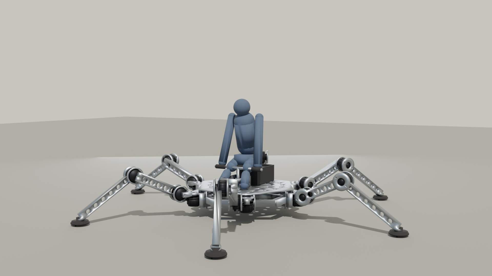

# Human-Carrying Hexapod Walker

A parametric STL generator for a **human-rider-sized six-legged walking
vehicle.** One Python script (`hexapod_walker.py`) emits 11 individual
STL parts plus an assembly-preview STL of the whole vehicle in standing
pose. A second script (`build_full_assembly.py`) emits a fully-dressed
assembly — frame, 18 motor housings, battery + cells, foot rubber,
saddle padding, and a stylized seated rider — split into 5 category
STLs that the Blender render script materials separately.

* Vehicle envelope: ~ 4.0 m foot-to-foot, ~ 1.3 m saddle height
* Payload: 1 rider, ≤ 110 kg
* 18 actuators (3 DOF × 6 legs), driven by industrial harmonic-drive servos
* Total dry mass ~ 280 kg
* See [`ASSEMBLY.md`](ASSEMBLY.md) for the full build guide, BOM, motor
  selection, electronics, gait, and safety notes.



## Quick start

```bash
# from the repo root
./run.sh hexapod_walker/hexapod_walker.py        # 11 fabricable STLs
./run.sh hexapod_walker/build_full_assembly.py   # full-assembly category STLs
./hexapod_walker/render_blender.sh \              # photoreal Cycles render
    --device METAL --samples 256 \
    --out hexapod_walker/renders/walker_hero.png
```

## Generate the fabricable STLs

```bash
./run.sh hexapod_walker/hexapod_walker.py
```

This creates `hexapod_walker/stl/` containing:

| File | Qty for one vehicle | Recommended fabrication |
|---|---|---|
| `chassis_hex.stl` | 1 | Welded 80 × 80 × 6 mm sq. tube + plate, painted |
| `chassis_top_deck.stl` | 1 | 12 mm 6061-T6, CNC water-jet |
| `saddle_mount.stl` | 1 | CNC 6061-T6 or MJF PA12-CF |
| `battery_box.stl` | 1 | MJF PA12-CF or welded 3 mm aluminum |
| `electronics_bay.stl` | 1 | MJF PA12-CF |
| `coxa_bracket.stl` | 6 | CNC 6061-T6 or investment-cast A356 |
| `coxa_link.stl` | 6 | CNC 6061-T6 or investment-cast A356 |
| `femur_link.stl` | 6 | CNC end caps on a 90 × 120 × 6 mm Al extrusion |
| `tibia_link.stl` | 6 | CNC end caps on a 70 × 90 × 5 mm Al extrusion |
| `foot_pad.stl` | 6 (used as mould patterns) | 60-A urethane around a 6 mm steel disc |
| `motor_flange.stl` | 18 | MJF PA12-CF or CNC 6061-T6 |
| `assembly_preview.stl` | 0 (visualization only) | Open in MeshLab / Cursor STL viewer |

All 11 individual parts are watertight manifolds and load directly into
slicers and CAM software. The assembly preview is a visualisation
aggregate (overlapping parts, not booleaned) — don't try to slice it.

## Generate the full assembly + render

`build_full_assembly.py` emits a *visual* assembly that includes
everything you'd need to ship a finished walker — not just the
fabricable parts:

```bash
./run.sh hexapod_walker/build_full_assembly.py
```

This writes 6 STL files into `assembly/`:

| File | Contents | Material in render |
|---|---|---|
| `frame.stl`   | Chassis + top deck + 6 × {coxa bracket, coxa link, femur, tibia} + saddle post + handlebars + electronics bay | Brushed satin aluminum |
| `motors.stl`  | 18 × harmonic-drive servo housings (with cooling fins, output flanges, encoder caps) at every joint | Dark anodized aluminum |
| `battery.stl` | Battery enclosure + 2 × visible LiFePO₄ cell packs | Matte black powder-coat |
| `soft.stl`    | Urethane foot pads + saddle pad + saddle backrest + handlebar grips | Black rubber / leather |
| `rider.stl`   | Stylized 1.75 m seated rider (head, torso, arms gripping bars, legs on footrests) — for scale | Denim grey |
| `full.stl`    | All five categories merged into one mesh — drop-in for non-Blender STL viewers | n/a |

Then run the Blender render (Cycles, denoised):

```bash
./hexapod_walker/render_blender.sh                                # default
./hexapod_walker/render_blender.sh --device METAL --samples 256   # GPU + nicer
./hexapod_walker/render_blender.sh --camera-azimuth-deg 90        # side view
```

The wrapper auto-locates Blender, rebuilds the assembly STLs if any are
missing or stale, and runs `render_blender.py` headless. Default output
is `renders/walker.png` (1600 × 1000); a typical Cycles render on Apple
Silicon's `METAL` backend takes ~ 10 s at 96 samples or ~ 30 s at 256.

## Customising the design

Every dimension is a named constant near the top of
[`hexapod_walker.py`](hexapod_walker.py). The most useful knobs:

| Constant | Default | Tweak this if... |
|---|---|---|
| `CHASSIS_FLAT_TO_FLAT` | 1200 mm | You want a wider/narrower body |
| `COXA_LENGTH` | 150 mm | Hip-yaw axis ↔ hip-pitch axis offset |
| `FEMUR_LENGTH` | 600 mm | Thigh length |
| `TIBIA_LENGTH` | 800 mm | Shin length |
| `MOTOR_OD`, `MOTOR_BOLT_CIRCLE`, `MOTOR_LENGTH` | matched to Harmonic Drive FHA-40C | Your chosen servomotor has a different flange |
| `STANCE_FEMUR_DEG`, `STANCE_TIBIA_DEG` | -25°, +60° | Different ride height in the preview |

After editing, re-run `./run.sh hexapod_walker/hexapod_walker.py` —
expect ~ 1.5 s for a full regeneration.

## Status

Mechanical-design draft. **Not built or tested.** Use as a starting
point for an engineered build with proper FEA, fatigue, and thermal
review. See [`ASSEMBLY.md` § 14 (Disclaimer)](ASSEMBLY.md#14-disclaimer).

## License

Personal exploration — no license declared yet. Open an issue if
you'd like to use any of this.
