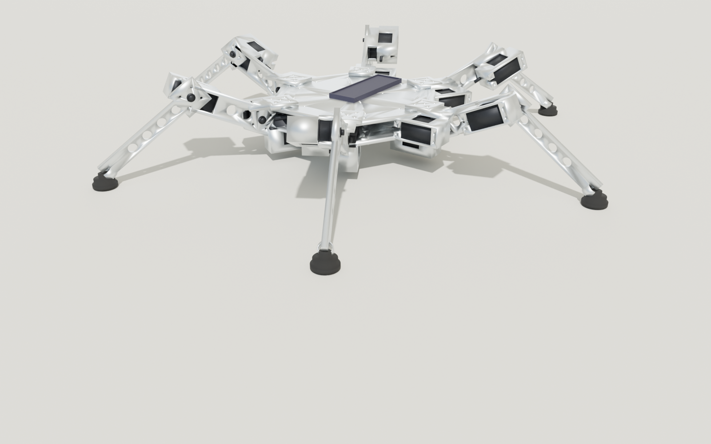

# Hexapod Walker — Tabletop Prototype Build Guide

> A scaled-down sibling of the [full-size walker](../ASSEMBLY.md) intended
> for proving out the geometry, kinematics, and gait controller before
> you commit to industrial servomotors. Same architecture: regular hex
> chassis, six identical 3-DOF legs, alternating-tripod gait — but
> everything is shrunk roughly 6× and every joint is driven by a
> generic 25 kg·cm hobby servo (DS3225 case/geometry) instead of a
> $5000 harmonic-drive servomotor.
>
> Total parts cost: **~$150 – $300** in 2026 USD. A motivated builder
> can have it walking on a tabletop in a weekend.



---

## 1. Why a separate prototype?

The full-size walker is a serious build: a 280 kg vehicle, $40 k+ BOM,
custom CNC and casting work. Even if your end goal is a rideable
walker, you almost certainly want to:

1. **Validate the kinematics and gait controller end-to-end** on cheap
   hardware before machining anything in aluminum.
2. **Iterate on the leg link ratios** without a 6-week lead time on
   castings — you can re-print every link in 12 hours.
3. **Train the gait scheduler in simulation, then prove it on real
   hardware** at 1/200 the mass and 1/250 the cost.
4. **Show the design works** to collaborators, funders, or your spouse
   before committing to the bigger build.

The prototype is **mechanically and kinematically identical** to the
full-size walker. The same six-legged tripod gait, the same per-joint
PID + feed-forward controller architecture, even the same coxa : femur
: tibia ~ 1 : 4 : 5 ratio. You can re-use the gait code unchanged
when you graduate to the big version — just re-tune the gains.

---

## 2. Specification at a glance

| Property | Value |
|---|---|
| Configuration | 6 legs × 3 DOF, alternating-tripod gait |
| Overall envelope (foot-to-foot, fully extended) | ~ 580 × 670 × 110 mm |
| Standing height (chassis underside) | ~ 70 mm |
| Stride length | ~ 120 mm |
| Cruise speed (tripod gait) | ~ 80 mm/s |
| Vehicle dry mass | ~ 1.3 kg |
| Per-leg static load (tripod stance) | ~ 4.3 N (~ 0.43 kg) |
| Peak knee torque | ~ 0.6 N·m (~ 6 kg·cm) |
| Battery | 1 × 3S 2200 mAh LiPo (11.1 V → 5 V BEC) |
| Continuous draw (cruise) | ~ 1.5 A @ 5 V |
| Run time, level ground | ~ 30 min |

**Knee torque margin:** the design target is a DS3225 25 kg·cm metal-gear
digital servo.  At 6.8 V it gives a ~ 4× safety factor over the
worst-case knee torque.  The printed wells, tab pilots and RL servo
torque limits are all tuned around this DS3225-class case.

> **Design B (May 2026):** the printed `servo_horn_adapter` disc has
> been retired.  Each link now bolts directly onto the plastic 4-arm
> X-horn that ships with the servo, via 4 x Phi 3.2 mm holes on a
> 20.8 mm PCD plus a 16 mm x 1.2 mm central hub recess cut into the
> link's pad face.  Drops the printed-leg-bolt-up Z stack by
> ``HORN_ADAPTER_T`` (4 mm) per joint.
>
> **Design E (May 2026) mixed-mode cradle bolts:** each cradle has
> 4 vertical M3 x 8 SHCS driven DOWN through the servo's mounting
> tabs.  Sites split by X sign:
>   * The 2 -X bolts thread into M3 brass heat-set inserts (McMaster
>     `94459A130`) pressed into Phi 4 mm pockets inside Phi 8 mm
>     printed bosses -- real metal threads, full pull-out durability.
>   * The 2 +X bolts self-tap into bare Phi 2.5 mm pilots in the
>     existing well-wall material (no boss enlargement, no insert).
>     The Phi 8 mm heat-set boss footprint physically cannot coexist
>     with the +X wire-exit channel that the servo's molded wire
>     boot must pass through during insertion; see
>     `INSERT_M3_SELFTAP_*` in `hexapod_prototype.py` for the
>     design-decision rationale and `check_servo_insertion_path`
>     in `_verify_prototype.py` for the regression probe.
> Counts per robot: **72 x M3 x 8 SHCS** (36 -X into-insert + 36 +X
> self-tap, same physical stock for both engagement modes) plus
> **36 x M3 brass heat-set inserts** (-X column only).  Replaces
> the brief Design C captive-nyloc and Design D all-heat-set
> iterations.
>
> **Design F (May 2026) chassis_bottom-integrated yaw cradle:**
> the standalone `coxa_bracket` (orange flange + dangling servo
> well) has been folded into the `chassis_bottom` plate as a
> per-leg printed-in cradle that grows up 11 mm from the plate's
> top face.  The yaw servo drops INTO chassis_bottom rather than
> hanging from a screwed-on flange; the servo's output shaft pokes
> up between the two chassis plates via the Phi 12 mm pass-through
> cutouts in `chassis_top` (currently a no-op because the cradle
> sites sit just outside chassis_top's 70 mm apothem, but the
> cutout intent is documented in `make_chassis_top()`).  The wire-
> exit corridor and zip-tie post mirror to the cradle's -X
> (radially-INBOARD) face, putting each leg's harness mouth right
> next to the existing leg drop slot in chassis_bottom and
> shortening each yaw cable run by ~ 62 mm of Manhattan distance.
> Fastener counts per cradle are unchanged from Design E (4 x
> M3 x 8 SHCS, 2 of which thread into M3 heat-set inserts); the
> previous 24 x M3 x 14 coxa-bracket-to-chassis bolts (4 per leg)
> and the matching 4-hole-per-leg pattern in `chassis_top` /
> `chassis_bottom` are dropped.  The legacy `coxa_bracket` STL is
> retired in the final cleanup commit of this redesign.

---

## Visual inspection

Three viewers share the same `part_palette.PART_COLORS` table, so a
given part type (e.g. `coxa_link` = green, `coxa_bracket` = orange,
`servo_body` = dark gray) is rendered with the *same* color in each:

- `make view-static`  — MuJoCo viewer, prototype frozen in stance pose
  (now colored by part type, body labels on by default).
- `make view`         — MuJoCo viewer, full physics + tripod gait.
- `make view-build`   — PyVista build inspector, colored + labeled
  parts, exploded-view slider, per-part-type hide toggle.

Forward extra flags through `ARGS=`, e.g.
`make view-build ARGS="--explode 1.0"` opens the inspector half-way
exploded, or
`make view-build ARGS="--screenshot artifacts/views/build_inspect.png"`
renders a single headless PNG and exits.

### PyVista build inspector controls

The `view-build` window prints these to stdout on launch:

**Mouse**

- **Hover** a part → its `part_type Lx  role` is shown in the top-of-window banner. No clutter from other parts.
- **Left-click** a part → every other part dims to 15% opacity while the picked part stays in place at full opacity. The clicked part does not move, so you can see exactly how it sits in the assembly without its neighbours obscuring it.
- **Left-click in empty space** (or press `I` / `Esc`) → restores every part's opacity to its full value.
- Left-drag still rotates the camera. Right-drag pans. Scroll zooms.

**Keyboard**

| Key | Action |
|---|---|
| `L` | Toggle the persistent all-labels-at-once cloud (off by default — hover is usually less noisy) |
| `E` | Toggle exploded view between 0.0 and 1.5 |
| `I` / `Esc` | Clear isolation |
| `R` | Reset the camera view |
| `S` | Save a screenshot to `artifacts/views/build_inspect.png` |
| `Q` | Quit |

The bottom slider (0.0 – 2.0) scales each part's distance from the
chassis centroid for finer exploded-view control than the `E` toggle,
and the row of color-coded checkboxes along the left edge hides or
shows all instances of a given part type so you can isolate, say,
just the coxa brackets or just the servo bodies. The MuJoCo
viewers' body-name labels default to ON (toggle with `B` once inside
the viewer).

If `view-build` errors out saying STLs are missing, run
`make build` first to regenerate `stl_prototype/`.

---

## How to validate / regenerate

The STLs under `stl_prototype/` are derived artifacts — the source of
truth is `hexapod_prototype.py` (geometry) plus `design_spec.yaml`
(human-readable contract). After any parametric edit, run the
validate → render → report pipeline from the repo root:

```bash
make -C hexapod_walker/prototype check-cad        # full validate + render + report
make -C hexapod_walker/prototype check-cad-fast   # inner-loop variant
```

Both targets rebuild `stl_prototype/`, run the validators, render
4-view PNGs per part under `artifacts/views/`, and write
`artifacts/cad_report.md`. See [`CAD_WORKFLOW.md`](CAD_WORKFLOW.md) for
the full pipeline and [`CAD_AGENT_INSTRUCTIONS.md`](CAD_AGENT_INSTRUCTIONS.md)
for the rules LLM coding agents should follow when editing CAD.

The legacy verifier `_verify_prototype.py` is parallelised via a
process pool and exposes several CLI flags for faster inner-loop
iteration:

| Flag | What it does |
|---|---|
| `--fast` | Run only the 5 ESSENTIAL checks (watertightness, self-collision standing, fastener engagement, mating-face contact, cable clearance). ~5-15 s vs ~95-270 s for the full suite. Use between every edit. |
| `--all` | Explicit full-suite mode (same as no mode flag). |
| `--changed` | SMART SELECT: only run checks whose static input deps intersect what `git diff origin/main` changed. Rebuilds STLs in-memory to detect which printed parts actually changed bytes; consults the `CHECK_INPUTS` map. Compose with `--fast` to intersect with the essential set. Pass `--base-ref REF` to diff against a different ref. |
| `--no-cache` | Bypass the persistent per-check cache (`hexapod_walker/prototype/.verify_cache.sqlite`). Lookups are skipped; writes still happen. Use when you've edited a verifier helper that the cache key intentionally doesn't track. |
| `--serial` | Skip the process pool entirely; run every check in the main process in declaration order. Use this when a worker traceback is mangled through pickle and you need a clean stack. |
| `--workers N` | Override the default worker count (default `min(8, os.cpu_count())`). |
| `--profile PATH` | Dump a cProfile snapshot of the parent process to `PATH` when the run finishes (combine with `--serial` to profile the entire suite in one process). |
| `--only CHECK_NAME` | Run only the named check(s). Repeatable: `--only "Servo clearance" --only "Workspace self-collision"`. Names match the declaration list (see top of `_verify_prototype.py` `CHECKS`). |

Make targets wrap the common flag combinations:

| Target | Underlying command | Typical use |
|---|---|---|
| `make verify-prototype` | `_verify_prototype.py` (full suite, cache-aware) | Pre-commit / pre-print gate. |
| `make verify-fast` | `_verify_prototype.py --fast` | Inner-loop between every edit. |
| `make verify-changed` | `_verify_prototype.py --changed` | After a small CAD edit; selects only checks affected by the diff. |

All flags compose with the existing `--with-arm` flag. Parallel output
is printed in declaration order so a `diff` against the serial baseline
is byte-for-byte clean for every `[PASS]/[FAIL]` line.

The persistent per-check cache stores `(check_name, input_hash) ->
(result, runtime_s, message, timestamp)` rows in
`.verify_cache.sqlite` (gitignored). The hash mixes the check
function's own source, every STL file in `stl_prototype/`, and the
`hexapod_prototype` + `fastener_registry` module sources. A second
run with no inputs changed hits the cache for every check and lands
in ~1-2 s end-to-end. Rows older than 30 days are pruned on every
invocation. Bust with `--no-cache` or by deleting the sqlite file.

`--changed` walks `git diff origin/main` and rebuilds every STL
in-memory to detect which printed parts ACTUALLY changed bytes (so a
cosmetic comment-only edit to `hexapod_prototype.py` selects zero
checks). It consults two maps near the top of `_verify_prototype.py`:

* `CHECK_INPUTS` -- per-check set of printed-part STL names the check
  consults. Future checks MUST add an entry; missing entries default
  to `ALL_PRINTED_PARTS` (safe but defeats selection).
* `CHECK_SOURCE_DEPS` -- per-check set of registry-source tags
  (`fastener_registry`, `cable_keepouts`, ...) that should also
  trigger the check.

If `_verify_prototype.py` itself is in the diff, `--changed` falls
back to "select all"; the cache then dedups unchanged check sources
at exec time.

### Opt-in strength / failure-point check

A SEPARATE pipeline lives under `hexapod_walker/prototype/strength/`
that runs a closed-form Euler-Bernoulli beam-bending sanity check on
the slender links plus -- when the toolchain is available -- a
CalculiX linear-static FEA pass on every load-bearing printed part.
Output is `artifacts/strength_report.md` (with per-part stress-field
PNGs under `artifacts/strength/`).

This pipeline is **deliberately not** wired into `make check-cad`.
It's observation-only and you opt in explicitly:

```bash
make -C hexapod_walker/prototype check-strength            # PETG (default)
make -C hexapod_walker/prototype check-strength MATERIAL=pla
make -C hexapod_walker/prototype check-strength PARTS=tibia_link,femur_link SOLVER=beam
make -C hexapod_walker/prototype check-strength SOLVER=beam   # closed-form only
```

**Installing the toolchain (macOS):**

```bash
# Tetrahedral mesher (works on Apple Silicon).
brew install gmsh

# CalculiX solver (Intel macOS / Linux):
brew install costerwi/homebrew-calculix/calculix-ccx

# Python deps land in the repo's shared venv via run.sh; if you
# bypass run.sh, install manually:
uv pip install pygmsh meshio
```

As of May 2026 the `calculix-ccx` Homebrew formula does **not** build
on Apple Silicon (the bundled ARPACK fails to link `_dseupd_`);
`gmsh` works fine.  If `ccx` is missing the pipeline falls back to
the beam-bending check alone and notes the missing solver in the
report.  On Linux (Ubuntu) `apt install calculix-ccx gmsh` covers
both.

**What the load cases look like** (derived from the design constants
in `hexapod_prototype.py` and an inferred 2.15 kg assembled mass):

| Part | Load case | Source |
|---|---|---|
| `tibia_link`    | foot tip -Z impact = `robot_weight / 3 * 2g` | `FEMUR_LENGTH`, `TIBIA_LENGTH`, `XHORN_BOLT_PCD` |
| `femur_link`    | knee-end -Z impact = same `2g` foot load           | same + `FEMUR_LENGTH` |
| `coxa_link`     | DS3225 stall = 2.5 N-m about the yaw axis          | `COXA_LENGTH` + `DS3225_STALL_TORQUE` |
| `chassis_bottom`| dead load (battery + tray + 6 cradle/leg masses)   | `BATTERY_HOLDER_CENTRE_X`, yaw cradle XY |
| `chassis_top`   | dead load minus battery                            | same supports |
| `foot_pad`      | foot-strike pressure on the disk floor             | `FOOT_PAD_OD`, `FOOT_HINGE_PIN_HOLE_D` |

The strength module imports from `hexapod_prototype` but the reverse
is forbidden -- a missing FEA toolchain cannot break the geometry
build.

### `check_screwdriver_access` envelopes

The screwdriver-access check probes a per-fastener cylindrical
clearance cone above each head along the driver-approach axis and
fails if any printed part intrudes by more than 30 mm³. Three
envelopes are dispatched off `FastenerInstance.spec`:

| Envelope | Dia × length | Used for |
|---|---|---|
| `HEX_KEY`  | 8 mm × 30 mm  | SHCS (M3x8 / M3x14 / M3x32) + the M2.5 spline center screw — anything driven with an L-shaped hex key short arm |
| `PHILLIPS` | 12 mm × 80 mm | `pan-head` / `Phillips` / `slotted` — currently just the M3x16 foot hinge bolt |
| `SOCKET`   | 12 mm × 50 mm | `nyloc nut` / generic `nut` — M3 nyloc driven with a 5.5 mm nut socket |

Spline center screws are technically a small Phillips on hobby
servos, but every such fastener is also explicitly SKIPped (captive
under the X-horn after assembly), so they're mapped to `HEX_KEY`
purely so the per-spec envelope table reads consistently. See the
top of `check_screwdriver_access` in `_verify_prototype.py` for the
exact dispatch logic.

---

## 3. STL files in `stl_prototype/`

Run the one-command prototype builder to generate every print/export bundle:

```bash
./run.sh hexapod_walker/prototype/build_all.py
```

For only the individual slicer-ready part STLs, run
`./run.sh hexapod_walker/prototype/hexapod_prototype.py`. All dimensions are
in millimetres. All individual STLs are sized to fit a 220 × 220 mm
3D-printer bed (Ender 3 / Bambu A1 mini class).

### 3.1 Body parts (one of each)

| File | Function | Suggested print settings |
|---|---|---|
| `chassis_top.stl` | Top hex deck (4 mm PLA, 200 mm flat-to-flat).  Carries 2 x Phi 8 mm printed bosses near the +X edge for the `switch_holster` heat-set inserts. | 0.2 mm layer, 25% gyroid infill, 4 walls |
| `chassis_bottom.stl` | Identical bottom plate | same as top |
| `battery_holder.stl` | Open-top tray for one 3S 2200 mAh LiPo.  Has a 14 x 12 x 10 mm cable-clearance notch at the +X -Y corner of the cradle so the Pi 4 / Pi 5's USB-A 3.0 plug can be inserted without colliding with the cradle wall (see `cable_keepouts.py`). | 0.2 mm layer, 20% infill |
| `electronics_tray.stl` | 160 x 130 mm mount deck for Arduino Mega 2560 + Raspberry Pi 4/5 + 2 x PCA9685.  Both PCA9685s are now bolted (8 x M3 inserts total) instead of cable-tied. | 0.2 mm, 20% infill, 2 walls |
| `bec_cradle.stl` | Snap-fit clip for 2 x 5V 5A switching BECs.  Sits on top of the electronics_tray near the -Y edge in the corridor between the Mega's +X edge and PCA2's -X edge.  No fasteners (interference fit on long sides + retention lip).  Phi 5 mm wire-exit channels at +/- X ends route the XT60 input pigtail and the 3-pin servo-header output pigtail. | 0.2 mm, 25% infill, 3 walls |
| `switch_holster.stl` | Snap-in holster for one ~ 32 x 17 x 17 mm anti-spark on/off switch.  Bolted to chassis_top's +X edge via 2 x M3 x 10 SHCS that thread DOWN into M3 brass heat-set inserts captive in chassis_top's 2 printed bosses.  Toggle protrudes +X past the chassis edge for user access; XT60 pigtails exit the +/- Y end faces. | 0.2 mm, 25% infill, 3 walls |
| `imu_pad.stl` | 25 x 20 x 2 mm pad with 4 x Phi 8 mm bosses (3 mm tall) carrying M3 brass heat-set inserts on the GY-521 15 x 11 mm pattern (4 x Phi 3.0 mm clearance holes).  Bolts the MPU-6050 IMU breakout via 4 x M3 x 8 SHCS.  **No fasteners between the pad and chassis_top** -- the pad's flat smooth underside is bonded to chassis_top's centre with 3 mm double-sided foam tape, which serves AS the mount AND the vibration damper.  Sits at chassis (0, 0, chassis_top_top_z + 3 mm) -- the chassis centre of gravity, so gyro rates are not contaminated by linear-acceleration cross-coupling from body swing. | 0.2 mm, 25% infill, 3 walls |

### 3.2 Per-leg parts (print 6 sets)

(May 2026 Design F: the standalone `coxa_bracket.stl` is RETIRED.
The yaw servo now drops into an integrated cradle in `chassis_bottom.stl`
(see Part 3.1); there is no separate per-leg bracket part.)

| File | Function | Print orientation |
|---|---|---|
| `coxa_link.stl` | U-arm driven by the yaw servo's horn; carries the hip-pitch servo in a side-loaded well. | Hub face down, well opening up |
| `femur_link.stl` | I-beam thigh with a slot through the spar so the knee servo body can slide past it during assembly. Top + bottom flange bridges connect the spar to the well. **Knee cradle floor is OPEN** (May 2026 supports-free refactor) so the part prints flat with no bridged ceiling. | Spar's broad face flat on bed; knee cradle opens downward through the bed and upward through the print's top -- no closed floor, no supports needed. |
| `tibia_link.stl` | Shin link with knee pad at one end and a single 6 mm-wide TANG at the other (foot-hinge end). **Tibia is `LINK_THICKNESS` = 6 mm wide in Y everywhere** (May 2026 supports-free refactor), so the entire part prints flat as a 6 mm-tall slab. | Spar's broad face flat on bed, no supports. |
| `foot_pad.stl` | Compliant foot with a 2-cheek FORK at +Z (May 2026 inversion: foot now carries the fork, tibia carries the tang). M3 x 16 pan-head pin + M3 nylock captures the joint just as before. Print in TPU 95A for grip and ankle compliance. | Disk on bed, fork up. Fork cheeks are 3.5 mm thick TPU walls and the 6.4 mm slot between them prints in air -- no supports needed (vertical features only). |

### 3.3 Visualization (do not print)

| File | Function |
|---|---|
| `assembly_preview.stl` | All parts placed in standing pose. Open in MeshLab or Cursor's STL viewer to sanity-check before printing. |

### 3.4 Don't have a 3D printer? Order from a print service

Run `./run.sh hexapod_walker/prototype/prepare_xometry_upload.py` to build a
self-contained order package in `xometry_upload/`. The script
re-orients each part for printing (hollow servo pockets opening
toward +Z, broadest flat face on the build plate), consolidates the
two identical chassis plates into a single file with `qty=2`, and
emits a `manifest.csv` listing the recommended material, color, and
finish for every part. See `xometry_upload/README.md` for the full
upload-and-checkout flow on Xometry, Shapeways, JLCPCB, etc.

A complete bundle runs **~ $580 in MJF PA12** (Xometry, mid-2026)
versus **~ $20 in PLA filament** if you have access to an FDM
printer.

---

## 4. Bill of materials

### 4.1 Actuators (the long pole)

| Item | Spec | Qty | Approx. cost |
|---|---|---|---|
| Hobby servo | **DS3225 25 kg·cm metal-gear digital servo**, standard 40 × 20 × 38 mm case, 54 mm tab span, ~49.5 mm tab-hole spacing, output offset ~10 mm from case centre. Buy all 20 from the same listing/batch. | 18 + 2 spare | ~$13 each on AliExpress, ~$18 each on Amazon ($260 – $360 total) |

### 4.2 Power

| Item | Spec | Qty | Cost |
|---|---|---|---|
| LiPo battery | 3S 2200 mAh 25C, XT60 connector | 1 | $20 |
| BEC (5–6 V regulator) | 5 V 5 A switching, 3S input, Hobbywing UBEC form factor (~ 24 x 15 x 8 mm body).  One per PCA9685 (see `bec_cradle.stl`). | 2 | $8 each |
| Anti-spark on/off switch | XT60 in/out pigtails, ~ 30 x 15 x 15 mm body (e.g. "LowPro RC" or "HRB").  Snaps into `switch_holster.stl` on chassis_top's +X edge; toggle protrudes outside the chassis for user access. | 1 | $10 |
| LiPo charger | iSDT D2, B6AC, or any decent 3S balance charger | 1 | $30 |
| LiPo bag | Fire-safe charging | 1 | $10 |

### 4.3 Control electronics

| Item | Spec | Qty | Cost |
|---|---|---|---|
| Arduino Mega 2560 (ELEGOO R3 clone) | ATmega 2560, 5 V; mounts to electronics_tray via 4 x M3x8 SHCS + 4 x M3 brass heat-set inserts (McMaster 94459A130) | 1 | $15 |
| Raspberry Pi 4 Model B / Pi 5 | High-level brain (ROS 2, vision, gait planning); mounts to electronics_tray via 4 x M2.5x8 SHCS + 4 x M2.5 brass heat-set inserts (McMaster 94459A106) | 1 | $45 |
| PCA9685 16-channel PWM driver | I²C, 12-bit; **both** bolt to the tray now (4 x M3x8 SHCS + 4 x M3 heat-set inserts each, 8 x of each total).  Secondary daisy-chains over I²C at address 0x41 (jumper). | 2 | $4 each |
| MPU-6050 IMU | 6-DOF gyro + accel, I²C (optional but useful) | 1 | $4 |
| Jumper wires | F-F, 20 cm × 50 + servo extensions × 18 | — | $15 |
| Logic-level wiring + heat-shrink | — | — | $5 |

### 4.4 Fasteners

| Item | Qty | Notes |
|---|---|---|
| M3 × 8 mm socket-head cap screws | ~ 50 | Link → horn bolts (4 per servo x 18 servos = 72; can also use 6 mm or 10 mm), chassis tie-rods. |
| M3 × 12 mm | 24 | Standoffs between top + bottom chassis plates |
| M3 × 14 mm SHCS | 72 + spares | **Design C servo-mount bolts**: horizontal, through the +/-X cradle walls and the servo tabs, into captive M3 nyloc nuts on the outer face. |
| M3 × 16 mm pan-head | 6 + spares | Foot hinge pins (one per leg). |
| M3 nyloc nuts | >= 6 + spares | One per foot hinge pin (May 2026 Design F: the 72 captive servo-mount nuts and the 24 coxa-bracket-to-chassis nuts have BOTH been retired). |
| M3 × 32 mm round standoffs (M-F) | 4 | Top-to-bottom chassis spacers; brass M-F, length = `CHASSIS_GAP` = 32 mm.  On the rotated-45-deg 35-mm-radius pattern (= `CHASSIS_STANDOFF_HOLES_XY` = (±35, 0) and (0, ±35)) -- May 2026 tray-mount fix moved the standoffs OFF the (±24.75, ±24.75) tray-mount pattern so chassis_bottom could carry heat-set inserts for the tray-mount bolts. |
| M2.5 self-tappers (horn → spline) | 18 | Ships with the servos.  Holds the plastic 4-arm X-horn onto the servo output spline. |
| M3 brass heat-set inserts (McMaster 94459A130) | 22 | Electronics-tray board mounts: 4 for the Mega 2560 + 4 for the primary PCA9685 + 4 for the secondary PCA9685.  Plus 2 more in `chassis_top`'s 2 printed bosses for the `switch_holster` mount bolts.  Plus 4 more in the `imu_pad`'s 4 boss tops for the MPU-6050 mount.  Plus 4 more in `chassis_bottom`'s 4 printed tray-mount bosses for the electronics_tray chassis-mount bolts (May 2026 tray-mount fix).  Soldering-iron installed into the printed Phi 4 mm pilot pockets BEFORE the electronics / holster / IMU / tray go on. |
| M2.5 brass heat-set inserts (McMaster 94459A106) | 4 | Electronics-tray board mounts for the Raspberry Pi 4 / Pi 5.  Same soldering-iron install workflow as the M3 inserts. |
| M3 × 8 SHCS (board mounts + IMU + tray-mount) | 20 | 4 x Mega 2560 + 4 x primary PCA9685 + 4 x secondary PCA9685 onto the M3 electronics-tray inserts, plus 4 x MPU-6050 (GY-521) onto the M3 imu_pad inserts, plus 4 x electronics_tray chassis-mount bolts that thread DOWN through the tray's cbore floor into chassis_bottom's tray-mount heat-set inserts (May 2026 tray-mount fix). |
| 3M VHB / 3 mm foam tape | ~25 × 20 mm | Bonds `imu_pad.stl` to chassis_top centre.  Doubles as vibration damper that decouples the MPU-6050's gyro from the servo-driven chassis frame.  See §B.6 of `SHOPPING_LIST.md`. |
| M3 × 10 SHCS (switch_holster mount + chassis_top standoff) | 6 | 2 for the switch_holster (drop the printed `switch_holster.stl` onto chassis_top's 2 bosses and thread DOWN through the holster ear's Phi 3.4 mm clearance holes into the heat-set inserts captive in the bosses); 4 more dropped DOWN from above chassis_top into the brass M-F standoff's female top threads (May 2026 tray-mount fix; brass standoffs are 32 mm long and span the inter-plate gap on the rotated-45-deg 35-mm-radius pattern).  Same stock as the battery_holder foot bolts. |
| M3 nyloc nuts (chassis_top standoff retention) | 4 | UNDER chassis_bottom on the rotated-45-deg standoff pattern (±35, 0) and (0, ±35).  Captures the brass M-F standoff's male thread that protrudes DOWN through chassis_bottom's Phi 3.4 mm clearance hole.  Plus 6 more on the foot hinge pins (one per leg) -- see foot_pad row. |
| M2.5 × 8 SHCS (board mounts) | 4 | 4 x Raspberry Pi 4 / Pi 5 onto the M2.5 inserts. |

### 4.5 3D-printed material

| Item | Spec | Qty | Cost |
|---|---|---|---|
| PLA filament | 1.75 mm, any colour | ~ 250 g | $5 |
| TPU filament | 1.75 mm, 95A | ~ 50 g (foot pads only) | $5 |

### 4.6 Total

| Bucket | DS3225 build |
|---|---:|
| Actuators | ~$300 |
| Power | ~$70 |
| Electronics (incl. Raspberry Pi 4) | ~$100 |
| Fasteners + filament | ~$20 |
| **Total** | **~ $490** |

---

## 5. Print plan

A single Ender 3-class printer runs the whole BOM in roughly **21 hours**:

| Pass | Parts | Bed | Time |
|---|---|---|---|
| 2 | 6 × coxa_link | Same | ~ 4 h |
| 3 | 6 × femur_link | Same | ~ 5 h |
| 4 | 6 × tibia_link | Same | ~ 4 h |
| 5 | chassis_top + chassis_bottom + battery_holder + electronics_tray + switch_holster + bec_cradle + imu_pad | ~ 4 h |
| 6 | 6 × foot_pad (TPU) | Single bed | ~ 1 h |

Tip: use 4 walls and 25 % gyroid infill for the bracket and link
parts — the servo cradles see the most load and the extra walls add
substantial stiffness for very little weight.

---

## 6. Assembly sequence

Allow ~ 4 hours for a first build, ~ 90 min for a second.

### 6.1 Per-leg sub-assembly (do all 6 in parallel)

> Both the **coxa bracket**, the **coxa link** (hip-pitch cradle), and
> the **femur link** (knee cradle) use the **Design E mixed-mode**
> vertical servo-mount (May 2026): each cradle has 4 vertical M3 x 8
> SHCS that thread DOWN through the servo's mounting tabs.  The 2 -X
> bolts thread into M3 brass heat-set inserts (McMaster `94459A130`)
> pressed into Phi 4 mm pockets inside Phi 8 mm printed bosses; the
> 2 +X bolts self-tap into bare Phi 2.5 mm pilots in the existing
> well-wall material (NO heat-set insert on this column).  The +X
> column reverted to self-tap because the Phi 8 mm heat-set boss
> footprint could not coexist with the +X wire-exit channel that the
> servo's molded wire boot must pass through during insertion -- see
> the `INSERT_M3_SELFTAP_*` constant block in `hexapod_prototype.py`
> and `check_servo_insertion_path` in `_verify_prototype.py` for the
> regression probe.

1. **Press the heat-set inserts BEFORE seating any servo:** for each
   cradle (18 total: 6 yaw cradles integrated into `chassis_bottom` +
   6 hip-pitch cradles in the coxa links + 6 knee cradles in the
   femurs), heat 2 x M3 brass heat-set inserts (McMaster `94459A130`)
   with a soldering iron at ~ 250 °C and press them into the 2
   -X-column Phi 4 mm pockets.  Hold light downward pressure for
   ~ 10-15 s per insert until the knurl displaces plastic into the
   boss wall; the insert top should land flush with the cradle's
   internal tab shelf (cradle-local z = +6 mm), 5 mm below the
   cradle's rim, so the bolt head clamps the servo ear against
   plastic, not brass.  Do NOT press inserts on the +X column --
   those 2 sites are bare Phi 2.5 mm self-tap pilots and any
   heat-set insert there would block the wire boot during
   insertion.
   * **chassis_bottom yaw cradles (12 inserts total: 2 per cradle x
     6 legs):** after printing chassis_bottom, look DOWN at the top
     face of each yaw cradle.  Each cradle has 2 visible Phi 4 mm
     holes on its inboard rim (cradle-x = -24.75 mm, y = +/-5 mm)
     -- these are the heat-set pockets, which were drilled THROUGH
     the cradle's 5 mm shroud (May 24 2026 fix) so the operator
     can see and access them.  Press each M3 brass insert DOWN
     through the rim using the soldering iron at ~ 250 °C; the
     insert seats with its top flush with the tab shelf, ready for
     an M3 x 8 SHCS to thread down into it from above the servo
     ear at step 2.  (Before the May 24 2026 fix the heat-set
     pockets were capped by 3 mm of shroud material that hid them
     from view and blocked installation; if you printed an older
     chassis_bottom from before that commit, redrill the 12 holes
     manually through the rim with a 4 mm bit and a hand drill.)
   * **coxa_link / femur_link cradles (12 inserts total: 2 per
     cradle x 6 of each link):** same workflow, but these cradles
     have NO shroud above the shelf so the heat-set pocket is
     visible directly from the cradle rim with no through-shroud
     cut required.
2. **Yaw servo into coxa bracket:** drop the yaw servo straight DOWN
   through the body cutout in the bracket flange and into the well
   below.  The servo's tabs land flush on the well rim, with the
   gear stack + output spline poking UP above the flange and the
   wire boot sliding down through the +X wire channel.  Drive 4 x
   M3 x 8 SHCS straight DOWN through the servo's tab holes: the 2
   -X bolts thread into the brass heat-set inserts; the 2 +X bolts
   self-tap into the Phi 2.5 mm pilots in the cradle's +X wall
   material.  Use a 2.5 mm hex key; finger-tight + 1/4 turn is
   enough for self-tap (over-tightening will strip the plastic).
3. **Plastic horn on the yaw servo:** centre the servo, push a stock
   plastic 4-arm X-horn onto the spline at 0 deg, then secure it with
   the M3 horn-attach screw that ships in the servo bag.
4. **Coxa link:** drop the link's hub pad onto the X-horn -- the
   16 mm recess on the underside of the pad seats the horn's central
   hub -- and bolt the link to the horn with 4 x M2 x 8 SHCS through
   the pad's M2 clearance holes into the X-horn's pre-drilled arm
   holes.
5. **Hip-pitch servo:** repeat the heat-set / self-tap install on the
   coxa link's hip-pitch cradle (2 inserts on the -X column FIRST,
   then drop the servo, then drive the 4 M3 x 8 SHCS as in step 2).
   Fit a plastic 4-arm X-horn perpendicular to the leg arm so the
   femur swings up and down.
6. **Femur:** seat the femur's hip-end pad on the hip horn (16 mm
   recess engaging the horn hub) and bolt to the horn with 4 x M2 x
   8 SHCS into the X-horn arms.
7. **Knee servo:** repeat the heat-set / self-tap install on the
   femur's knee cradle (2 -X heat-set inserts pressed BEFORE the
   servo goes in, then 4 M3 x 8 SHCS down through the tab holes).
   Plastic X-horn perpendicular to the femur spar.
8. **Tibia:** seat the tibia's knee-end pad on the knee horn and
   bolt to the horn with 4 x M2 x 8 SHCS into the X-horn arms.
9. **Foot pad:** slide the foot pad's FORK over the tibia's tang
   from below (May 2026 hinge inversion -- the foot now carries
   the fork, the tibia carries the single tang), align the M3
   holes in both cheeks with the M3 hole in the tang, and drive
   one M3 x 16 pan-head bolt (92010A130) THROUGH the fork +
   tang into an M3 nylock nut on the far cheek.  Tighten just
   until the joint is snug but still rotates freely.  The hinge
   axis is parallel to the knee pitch axis so the foot pitches
   passively about it as the leg walks.

You now have a complete leg dangling from a coxa bracket. Repeat 6
times.

### 6.2 Final assembly

9. **Bottom chassis plate:** lay flat. Each coxa bracket's flange
   bolts to the chassis edge with **4 × M3 × 16 mm** caps — drive
   them straight down through the flange and through the matching
   bolt pattern in the chassis plate, capture with a nyloc on the
   underside. The two outboard bolts sit just inside the chassis
   perimeter; the two inboard bolts sit 16 mm further in. The flange
   sandwiches between the bottom plate and the standoff ring later
   in step 13.
10. **Tray-mount heat-set inserts:** soldering-iron-install **4 × M3
    brass heat-set inserts** (McMaster `94459A130`) into the 4
    printed Phi 6 mm × 3 mm tray-mount bosses on chassis_bottom's
    TOP face at the `ELEC_CHASSIS_MOUNT_HOLES_XY` = (±24.75, ±24.75)
    pattern.  Press the inserts DOWN from above with the iron at
    ~220 °C, light pressure, ~10-15 s until the knurl displaces
    plastic into the boss wall.  These inserts hold the electronics_
    tray-to-chassis_bottom bolts (May 2026 tray-mount fix; the
    tray used to share its bolt pattern with the brass M-F
    standoffs and physically could not bolt to anything).
11. **Battery holder:** press 4 × M3 brass heat-set inserts (McMaster
    `94459A130`, same SKU as the cradle inserts) into the holder's
    foot pockets from BELOW with a soldering iron at ~ 220 °C.  Set
    the holder onto the bottom chassis plate so each foot lands on
    one of the 4 dedicated mounting holes (the `with_battery_holder_
    holes` pattern at `(±BATTERY_FOOT_DX, ±BATTERY_FOOT_DY)` mm =
    `(±50, ±24)`).  Drive 4 × **M3 × 10 mm SHCS** UP from under the
    chassis_bottom plate, threading into each insert.  This pattern
    is INTENTIONALLY separate from the standoff pattern (the holder
    is wider than the 35 mm standoff radius); see
    `hexapod_prototype.make_chassis_bottom` and
    `fastener_registry._emit_battery_holder_fasteners` for the
    geometry.
12. **Electronics tray + boards (May 2026 hardware-arrival pass):**
    install all 12 board-mount fasteners NOW, before the top chassis
    plate goes on -- once chassis_top is bolted down the M3 SHCS
    heads on the Mega + PCA9685 and the M2.5 heads on the Pi are no
    longer driver-accessible.  Workflow:
    a. Soldering-iron-install **8 × M3 brass heat-set inserts**
       (McMaster `94459A130`) into the tray's Mega + PCA9685 bosses
       and **4 × M2.5 brass heat-set inserts** (McMaster `94459A106`)
       into the Pi bosses; same ~ 220 °C technique as the cradle /
       battery_holder inserts.
    c. Bolt the Mega 2560 onto its 4 M3 inserts with **4 × M3 × 8 mm
       SHCS**, the Pi onto its 4 M2.5 inserts with **4 × M2.5 × 8 mm
       SHCS**, and the primary PCA9685 onto its 4 M3 inserts with
       **4 × M3 × 8 mm SHCS**.  Boards sit 5 mm above the tray top
       on the printed standoff bosses; cables plug in from the ±X /
       -Y chassis edges.
    d. Drop the populated tray onto chassis_bottom's 4 tray-mount
       bosses (the tray's bottom face lands flush on the boss tops
       at chassis-z = +5 mm).  Drive **4 × M3 × 8 mm SHCS** DOWN
       through the tray's chassis-mount cbores into the heat-set
       inserts installed at step 10; the tray's Phi 5.5 mm × 2 mm
       counterbores recess the SHCS heads 1 mm below the tray's
       top face so the boards on their 5 mm standoffs clear the
       chassis bolt heads entirely.  May 2026 tray-mount fix: cbore
       depth was 3 mm before (= full tray thickness, leaving no rim
       for the head to clamp); shrunk to 2 mm so a 1 mm plastic rim
       survives at the cbore floor.
    e. **Stand-off posts (chassis-stack closure):** screw 4 × M3 ×
       **32 mm** M-F brass standoffs into the rotated-45-deg
       35-mm-radius pattern (`CHASSIS_STANDOFF_HOLES_XY` = (±35, 0)
       and (0, ±35)).  Each standoff's MALE thread drops DOWN
       through chassis_bottom's clearance hole; capture it from
       below with **4 × M3 nyloc nuts** (one per standoff).  The
       FEMALE top accepts an M3 × 10 SHCS dropped DOWN from above
       chassis_top in step 14.  May 2026 tray-mount fix: standoffs
       MOVED off the (±24.75, ±24.75) tray-mount pattern onto the
       rotated-45-deg pattern so the brass standoff body doesn't
       conflict with the chassis_bottom heat-set inserts installed
       at step 10.
    f. **IMU sub-assembly:** soldering-iron-install **4 × M3 brass
       heat-set inserts** (McMaster `94459A130`, same SKU as the
       cradle / battery / electronics-tray inserts) into the
       `imu_pad.stl`'s 4 boss-top pilots (Phi 4 mm × 6 mm pockets,
       same ~ 220 °C technique).  Bolt the MPU-6050 (GY-521) PCB down
       through its 4 × Phi 3.0 mm holes (15 × 11 mm GY-521 pattern)
       with **4 × M3 × 8 mm SHCS** into the inserts.  Peel a ~ 25 ×
       20 mm rectangle of 3 mm double-sided foam tape (3M VHB or
       generic mounting foam, §B.6 of `SHOPPING_LIST.md`) and stick
       it to the pad's flat smooth underside.  Press the loaded pad
       down onto chassis_top centred at (0, 0) -- this places the
       IMU at the chassis centre of gravity so gyro rates aren't
       contaminated by linear-acceleration cross-coupling from the
       body swing, and the foam tape acts as both adhesive AND
       vibration damper (decouples the gyro from servo HF noise).
       Route 5 Dupont jumpers (VCC, GND, SDA, SCL, INT) toward the
       electronics_tray's I2C cluster (a Phi 8 mm corridor is left
       clear above chassis_top for the harness).
13. **Wire it up:** see §7.
14. **Top chassis plate:** drop the printed `chassis_top.stl` onto
    the 4 brass standoff tops at the rotated-45-deg 35-mm-radius
    pattern (`CHASSIS_STANDOFF_HOLES_XY`).  Drive **4 × M3 × 10 mm
    SHCS** DOWN from above through chassis_top's Phi 3.4 mm
    clearance holes into the standoff's female top threads (May
    2026 tray-mount fix).  IMPORTANT: install BEFORE the
    switch_holster -- the +X standoff at (+35, 0) sits under the
    holster's footprint, so a hex key cannot reach that bolt's
    head once the holster is dropped onto its bosses.  Then drop
    the populated `switch_holster.stl` onto chassis_top's 2 +X
    bosses and bolt with **2 × M3 × 10 mm SHCS** as in step 14a
    below.

### 6.3 Retrofit for existing chassis_bottom prints (pre-May-2026-tray-mount-fix)

If you printed `chassis_bottom.stl`, `chassis_top.stl`, or
`electronics_tray.stl` from a build dated before the May 2026
tray-mount fix (cbore depth 3.0 mm, brass standoffs on the
(±24.75, ±24.75) pattern, no tray-mount bosses on chassis_bottom),
your printed plates won't accept the new fastener layout as-is.
You have two paths:

**Path A -- reprint (recommended):** regenerate
`stl_prototype/chassis_bottom.stl`, `stl_prototype/chassis_top.stl`,
and `stl_prototype/electronics_tray.stl` from the current
parametric source (`make -C hexapod_walker/prototype build`) and
reprint.  The 3 STLs together print in ~4 hours on a single Ender 3
bed.

**Path B -- modify in place (if reprinting is impractical):**
1. **Drill out the 4 existing Phi 3.4 mm holes at (±24.75, ±24.75)
   on chassis_bottom** to **Phi 4.0 mm** using a standard 4 mm
   drill bit.  These were originally the brass-standoff clearance
   holes; they become the heat-set insert pilots for the new
   tray-mount path.
2. **Press an M3 brass heat-set insert** (McMaster `94459A130`)
   into each enlarged hole from the TOP face using a soldering
   iron at ~220 °C, ~10-15 s of light pressure per insert.  The
   5 mm-long insert will protrude ~2 mm below the plate's bottom
   face -- this is structurally fine (no part interferes with
   the protruding section because the cradle bond-strips and
   battery_holder feet sit far outside the (±24.75, ±24.75) ring).
3. **Drill 4 NEW Phi 3.4 mm clearance holes** at the brass
   standoff pattern: (±35, 0) and (0, ±35) -- the same 35 mm
   radius rotated 45 deg from the existing tray-mount pattern.
   These become the new chassis-stack standoff sites.
4. **Reprint `electronics_tray.stl`** (the cbore depth changed
   from 3 mm to 2 mm; you need the new 1 mm cbore-floor rim for
   the M3 SHCS head to clamp against).
5. **Reprint `chassis_top.stl`** OR drill 4 NEW Phi 3.4 mm holes
   at the brass standoff pattern (same XY as step 3) into your
   existing chassis_top print.  The existing (±24.75, ±24.75)
   holes on chassis_top can stay as-is -- they are harmless under
   the new layout (the tray-mount M3 × 8 SHCS bolts stop in the
   chassis_bottom insert and never reach chassis_top).

Assembly order under either path: tray-mount heat-set inserts
FIRST → tray bolted DOWN onto chassis_bottom inserts → brass
standoffs threaded through chassis_bottom (M3 nyloc underneath)
→ chassis_top bolted DOWN onto standoff tops.

---

## 7. Wiring

### 7.1 One-servo bench test first

Before assembling the robot, test **one DS3225 + one PCA9685 + Arduino**
on the bench. This proves the exact servo listing you bought fits the
electrical and software assumptions before you print/bolt all 18 joints.

Bench wiring:

```text
Raspberry Pi / laptop  --USB serial-->  Arduino Mega
Arduino Mega SDA/SCL  ------------->  PCA9685 SDA/SCL
Arduino Mega 5V/GND   ------------->  PCA9685 VCC/GND  (logic only)
5-6 V BEC + / -       ------------->  PCA9685 V+ / GND (servo power)
DS3225 signal/+/-     ------------->  PCA9685 channel 0
```

Important: **all grounds must be common**: Pi USB ground, Arduino ground,
PCA9685 ground, and BEC/servo ground. Do **not** power the DS3225 from
the Arduino 5 V pin.

Upload the Arduino bridge sketch:

```bash
hexapod_walker/prototype/firmware/prototype_servo_bridge/prototype_servo_bridge.ino
```

Then from the Raspberry Pi or laptop:

```bash
python -m pip install pyserial
python hexapod_walker/prototype/pi_control/servo_bridge_client.py --port /dev/ttyACM0 centre
python hexapod_walker/prototype/pi_control/servo_bridge_client.py --port /dev/ttyACM0 wiggle --joint 0
python hexapod_walker/prototype/pi_control/servo_bridge_client.py --port /dev/ttyACM0 joint 0 20 --sweep
```

On macOS the port will look like `/dev/cu.usbmodem...`; on Raspberry Pi /
Linux it is usually `/dev/ttyACM0` or `/dev/ttyUSB0`.

Once one servo works, plug the same servo into channels 1 and 2 and run:

```bash
python hexapod_walker/prototype/pi_control/servo_bridge_client.py --port /dev/ttyACM0 wiggle --joint 1
python hexapod_walker/prototype/pi_control/servo_bridge_client.py --port /dev/ttyACM0 wiggle --joint 2
```

That validates the yaw / hip / knee channel order for one leg before
you connect all 18 servos.

### 7.2 Full robot wiring

```
                    +--------------+
                    |  Arduino     |
                    |  Mega 2560   |
                    +-+-+----+--+--+
                      | |    |  |
                  SDA/SCL   D2-D5
                      | |    |  |
            +---------+ |    |  +-- IMU MPU-6050 (I2C, addr 0x68)
            |           |    |
       +----+----+ +----+----+
       | PCA9685 | | PCA9685 |   I2C addr 0x40 + 0x41 (jumper)
       |  #1     | |  #2     |
       | ch 0-15 | | ch 0-1  |
       +-+-+-+...+ +-+-+-+...+
         | | |       | | |
        18 PWM lines to the servos:
            #1 ch  0-2  -> leg 0 (yaw, hip, knee)
            #1 ch  3-5  -> leg 1
            #1 ch  6-8  -> leg 2
            #1 ch  9-11 -> leg 3
            #1 ch 12-14 -> leg 4
            #1 ch 15    -> leg 5 yaw
            #2 ch  0-1  -> leg 5 hip + knee

  Power side (separate from logic):
            +-----------+
            | 3S LiPo   |  (XT60 -> on/off switch -> XT60 splitter)
            +-----+-----+
                  |
        +---------+---------+
        |                   |
     5V 5A BEC          5V 5A BEC
   (servo rail #1)    (servo rail #2)
        |                   |
        +-> PCA9685 #1 V+   +-> PCA9685 #2 V+
            (powers 9 servos)   (powers 9 servos)
```

Two BECs / two PCA9685s let you split the 18-servo current draw
across two regulators. A single 5 A BEC will brown out under
synchronous-walk current spikes (peak ~ 6 – 8 A across all 18 servos).

The Arduino gets its 5 V from one BEC's auxiliary output (or USB
during development) — DO NOT power the Arduino off the LiPo's raw
11.1 V via the barrel jack, the on-board regulator can't handle the
combined logic + sensor load.

### 7.3 Per-leg harness recipe

The 18-servo harness has three printed-in strain-relief features per
leg + one per servo, all designed so a 2-3 mm wide zip-tie can secure
the 3-wire bundle without yanking the JST plug at the PCA9685 header
when a leg snags mid-walk.  This section is the assembler-facing
recipe; the auto-generated BOM lives in
`pi_control/wire_harness_plan.py` and prints by running:

```bash
python -m hexapod_walker.prototype.pi_control.wire_harness_plan
```

That command emits a 18-row markdown table with one row per servo:
joint index, leg + axis, PCA board + channel, cradle wire-exit
position, drop slot position, PCA channel pin position, minimum
required path length, and the exact extension-cable shopping list
(stock pigtail / + 30 cm / + 60 cm / + N x 30 cm).  Re-run after any
electronics-tray or chassis geometry edit; the
`_verify_prototype.check_harness_reach` verifier asserts the printed
BOM still matches reality.

**Per leg, build 3 extension cables**:

1.  **Yaw servo** (cradle integrated into `chassis_bottom`, doesn't rotate with any
    upstream joint): typically `DS3225 stock pigtail` -- the harness
    drops straight through the chassis_bottom slot into the PCA.  L1 -
    L4 might need one +30 cm extension depending on which side of the
    tray their PCA channel lives.
2.  **Hip-pitch servo** (cradle on `coxa_link`, rotates with yaw):
    `+ 30 mm slack loop` around the yaw axis, then routes inboard to
    the drop slot.  L2 - L4 typically need one +30 cm extension.
3.  **Knee servo** (cradle on `femur_link`, rotates with yaw + hip):
    `+ 60 mm slack loop` (one across yaw, one across hip), then routes
    inboard along the femur, then the coxa_link, then through the
    drop slot.  L2 - L4 typically need one +30 cm extension; L3 knee
    is the longest path in the build.

**L5 cross-board callout** (the firmware mapping reserves PCA1's last
channel for L5 yaw and bumps L5 hip + knee onto PCA2):

* L5 yaw -> PCA1 (0x40) ch 15
* L5 hip-pitch -> PCA2 (0x41) ch 0
* L5 knee -> PCA2 (0x41) ch 1

The L5 hip + knee cables land on the OTHER PCA board, so route them
straight from the L5 drop slot toward PCA2 (-Y half of the tray)
rather than PCA1 (+Y half).  `wire_harness_plan.py` tags these two
entries with `(L5 cross-board: PCA2 0x41 ch{0,1})` so you can't miss
it.

**Slack-loop sizing** (the bundle's "extra" length at each joint
axis the harness crosses):

* Yaw axis:  ~20 mm slack loop in the bundle (the harness needs to
  twist ~90 deg across the yaw axis at full sweep).
* Hip axis:  ~30 mm slack loop (the hip-pitch range plus the
  coxa_link's WELL_Z_DROP_EXTRA = 4 mm vertical hop adds bundle
  length).
* Knee axis: ~20 mm slack loop (the knee range is the largest
  single-axis sweep but the bundle only crosses it on the knee
  cable, which is anchored close to the joint by the femur_link's
  knee-cradle zip-tie post).

The `wire_harness_plan.py` reach model uses a uniform 30 mm slack
budget per joint crossing; the per-axis numbers above are the
*minimum* the user should aim for at zip-tie time.  Err larger;
extra slack is harmless, deficit can fight the kinematics.

**Zip-tie placement** (3 per leg, 1 per servo cradle):

* `chassis_bottom` yaw cradle post (-X face): anchor the YAW harness about 10 mm
  past the cradle wire-exit slot.  Post sits on the well's +X
  outer face, just past the slot.
* `coxa_link` cradle post: anchor the HIP-PITCH harness right at
  the hip cradle wire-exit; lets the bundle exit the cradle with
  the slack loop OUTSIDE the bundle's anchor point.
* `femur_link` cradle post: anchor the KNEE harness at the knee
  cradle wire-exit.
* `chassis_bottom` per-leg drop slot: anchor the FULL 3-cable
  bundle just before it enters the chassis_bottom drop slot.  Each
  leg's cable drop slot doubles as the zip-tie anchor -- pass a
  zip-tie through the slot to bundle the per-leg harness.  (A
  previous revision printed a vertical tab hanging below the plate
  for this; it was retired in May 2026 to keep the plate's bottom
  face flat for easier FDM printing.)

**Terminating the bundle near the PCA header**:

Inside the inter-plate volume, the 3-cable bundle from each leg
drops through its drop slot, then walks toward the appropriate
PCA9685.  The PCA9685 has the channel headers on its long edge;
plug each cable into the channel printed on the silkscreen for that
joint.  At the PCA, leave a SHORT (~ 20 mm) tail before the plug so
the cable can be pulled off for replacement without tugging on the
adjacent channel plugs.  No printed zip-tie post is required at the
PCA itself -- the PCA's bolted-down PCB is the strain relief.

The Part C electronics-tray cable comb (a printed strain-relief
fence ALONG the PCA headers) is on the design roadmap but NOT in
this commit; until it ships, friction + zip-tying each leg harness
through its `chassis_bottom` drop slot are the strain-relief story.

---

## 8. Software

A starter Arduino sketch (~ 200 lines) is enough to walk the
prototype. You will need:

```cpp
#include <Wire.h>
#include <Adafruit_PWMServoDriver.h>

Adafruit_PWMServoDriver pwm1(0x40);
Adafruit_PWMServoDriver pwm2(0x41);

// Pulse-width mapping (DS3225: 500 us = -90 deg, 2500 us = +90 deg)
const float PWM_MIN_US = 500.0;
const float PWM_MAX_US = 2500.0;

// Per-joint trim (calibrate after first power-up)
float trim_deg[18] = { /* ... */ };

void writeJoint(int joint_idx, float angle_deg) {
    Adafruit_PWMServoDriver& drv = (joint_idx < 16) ? pwm1 : pwm2;
    int chan = joint_idx % 16;
    float us = PWM_MIN_US
             + (angle_deg + 90 + trim_deg[joint_idx]) / 180.0
             * (PWM_MAX_US - PWM_MIN_US);
    drv.writeMicroseconds(chan, (int)us);
}
```

Then add a ~ 50 Hz loop that runs the inverse kinematics for each leg
(closed-form 3R IK — coxa yaw, hip pitch, knee pitch — there's a
classical solution; see e.g. the "Phantom X / Lynxmotion AX hexapod"
references) and a tripod-gait scheduler.

If you want to use ROS instead of bare-metal Arduino, swap the Arduino
for a Raspberry Pi 4 running `ros2_control` + the same PCA9685
driver, and the same gait code (Python or C++) you intend to use on
the full-size walker.

---

## 9. Tuning notes

* **Per-joint trim:** the first thing you do after assembly is set
  every joint to its "neutral" angle (femur and tibia horizontal,
  pointing radially out) and adjust the `trim_deg` array until each
  link physically lines up. Mechanical horn-spline mounting introduces
  ~ 14 ° of quantization, so you'll see ~ 7 ° trim on each joint.
* **Pulse-width range:** check the actual mechanical end-stops by
  sweeping each joint slowly from 500 µs to 2500 µs. Cheap servos
  often only achieve ~ 160 ° of travel, not the advertised 180 °, so
  clamp `angle_deg` to ±80 ° in software.
* **Gait period:** start at 2 s per cycle (very slow, easy to debug),
  speed up to 1 s once the IK and trim are dialled.
* **Power supply sag:** if the robot collapses momentarily during
  swing-to-stance transitions, the BECs are sagging. Switch to a
  beefier 5 A switching BEC (D-Link D24V50F5 or similar) or split
  the 18 servos across 3 BECs instead of 2.

---

## 10. Migration to the full-size walker

The prototype's value is that **everything you build above the joint
level transfers unchanged** to the full-size walker:

* The IK math is identical (same coxa / femur / tibia ratio).
* The gait scheduler is identical.
* The per-leg state machine (stance / swing / lift / re-plant) is
  identical.
* The body kinematics + IMU fusion are identical.

What changes when you scale up:

* The actuators talk EtherCAT or CAN instead of PWM, so the joint
  driver layer changes.
* Joint torque limits are 100× higher, so the gait scheduler needs to
  add a torque-aware planner (don't command a stride that requires
  more than 70 % of peak knee torque).
* Safety: a 280 kg vehicle needs an E-stop, brake-on-fault behaviour,
  and a "freewheel only when stationary" supervisor — none of which
  matter on a 1.3 kg tabletop unit.

Plan to spend ~ 3 months walking on the prototype, ironing the gait
and IK out, before you cut metal for the full-size build.

---

## 11. Troubleshooting

| Symptom | Likely cause | Fix |
|---|---|---|
| Robot "twitches" but won't move | One BEC is browning out | Add a second BEC, verify 5 V steady on a scope under load |
| One leg drags | Per-joint trim is off, or that servo's output dead-band is unusually wide | Re-trim, or swap that servo (cheap servos have ± 10 ° unit-to-unit variation) |
| Knee servos overheat | Gait is over-loading (too high a chassis, too long a stride) | Lower chassis by re-targeting `STANCE_FEMUR_DEG = -15`, shorter stride |
| Robot drifts sideways | Tripod legs not lifting in sync | Increase swing duration; verify `trim_deg` for hip-pitch is consistent across all 6 legs |
| Foot slips on floor | TPU pad too smooth | Cut a small section of bicycle inner tube, glue inside the pad |

---

## 12. License & Disclaimer

Same as the parent project — personal exploration, no license declared
yet. The prototype is mechanically benign (small servos, small
batteries, no rider) but **3S LiPos can fight back if you puncture
them** — charge in a fire-safe bag and don't leave them charging
unattended.
