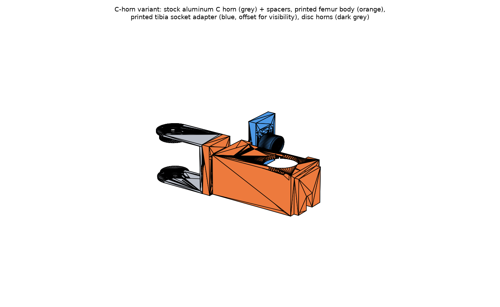

# Stock C-horn variant (Aug 2026) — opt-in, not the shipped design

User request: *"I'm also thinking about buying some stock C shaped horns -
can you make a new version of a redesign that uses stock aluminum horns
like that?"*

This variant replaces each joint's **printed moving clevis** (the femur hip
yoke and the tibia knee yoke — the members involved in both Aug 2026 field
cracks) with a **bought aluminum C-shaped horn**: a U/C bracket whose two
plates bolt onto the SAME two 20 mm disc horns the printed yokes use today
(driven disc on the 25T spline + stock passive disc on the rear idler
boss), and whose outboard web carries a small printed adapter.

Everything else is untouched: fixed sides (coxa hip cradle, femur knee
cradle + far-wall pad), clamp caps, disc horns, joint frames, tube cut
length, ROM. The shipped all-printed design stays the default; this lives
entirely in `extra_stl/chorn/` + `tools/make_chorn_variant.py`.

## Parts

| File (extra_stl/chorn/) | What | Qty if converting all 12 joints |
|---|---|---|
| `chorn_reference_DO_NOT_PRINT.stl` | The ASSUMED stock C horn, for fit-checking your purchase against | — (buy 12) |
| `spacers.stl` | 8 standoff spacers per joint (4× 4.0 mm top, 4× ~2.0 mm bottom — thickness auto-derived from the horn span) | print 96, or buy M3 alu standoffs |
| `femur_chorn_body.stl` | Printed femur: web flange + Ø18 spar (cone flares both ends) + unchanged knee fixed side | 6 |
| `tibia_chorn_socket.stl` | Printed tibia adapter: web flange + Ø18 CF-tube socket (Ø8.1 bore, epoxy-only, mouth at the same joint-local x = 62 → same tube cut) | 6 |

Per-joint hardware delta: **+1 C horn, +8 spacers, 4× M3×8 SHCS**
(plate + spacer into the disc taps; replaces the yokes' M3×10) and
**4× M3×10–12 COUNTERSUNK + nyloc** (web → printed flange; the nut sits in
a hex pocket on the flange's outboard face).

## What to buy — hard requirements (measure before ordering!)

The reference model uses ASSUMED dimensions typical of generic 2 mm
aluminum 25T C brackets. Any candidate horn must satisfy:

1. **Leg length ≥ 29.5 mm** from the spline axis to the web's **inner**
   face. HARD limit: the fixed clamp-cap flange sweeps r ≤ 29.1 mm in the
   yoke frame — a shorter C horn will strike the cap. Many small C horns
   fail this; measure first.
2. **Plate hole pattern** matching the 20 mm disc horn: 4× M3 on a Ø14
   BCD, plus a ≥ Ø10 centre clearance (the Ø9 spline collar stands 2 mm
   proud of the driven disc). A splined-hub C horn also works on the front
   side, but the REAR plate must still bolt to the passive disc (the rear
   idler boss is not splined) — the disc-pattern kind is simpler.
3. **Inner span ≥ 42.1 mm** (38.04 disc-to-disc + the mandatory 4 mm top
   spacer). Larger spans are fine — the bottom spacer absorbs the rest.
4. **Countersunk web holes** (or be willing to countersink them): the web's
   inner face passes the clamp-cap sweep with ~2 mm margin, so proud screw
   heads there will strike the cap. Screw heads must sit flush in the web;
   the nuts live in the printed flange's pockets.
5. Plate thickness ~2 mm, web wide enough for a 14×26 mm hole grid
   (2×2 M3 at y ±7, z ±13 about the spar line — or update the grid
   constants to match the horn's existing holes).

## Measured candidates (Aug 2026 sourcing pass) — what actually fits

Every small bus-servo C/U bracket on the market is span-sized to its own
servo's horn stack (36–40 mm), so they all fail our ≥ 42.1 mm span; the
short ones also fail the 29.5 mm cap-sweep leg limit. Numbers below are
from official drawings or caliper-measured community CAD, not listings:

| Candidate | inner span (need ≥ 42.1) | leg, axis→web inner (need ≥ 29.5) | verdict | source |
|---|---|---|---|---|
| Lynxmotion ASB-09 "Short C" | ~36 | 37 ✓ | span FAIL | RobotShop dims 51×24×40 outer |
| Feetech FK-US-001 | 51.6 ✓ | ~25 | leg FAIL | official FK-UB-001 drawing (Mantech PDF) |
| Feetech FK-US-002 | 40.2 | ~15 | both FAIL | same drawing |
| Hiwonder LX-16A straight U | 37.0 | ~32 ✓ | span FAIL (< 38.04 disc stack!) | caliper CAD, robotcopper/ros2_lx16a_driver |
| **MG996R-class "Long U"** (56×25×64.5, 2.2 mm alu) | **51.6 ✓** | **~50 ✓** | **PASS** | spec'd in listings (three independent sellers agree) |

**Recommendation: the generic standard-servo "Long U" bracket**
(56 × 25 × 64.5 mm, 2–2.2 mm aluminum, sold in every MG995/MG996R robot
kit). Width 25 ≈ the printed yokes' 24. Span 51.6 means a ~9.6 mm bottom
spacer stack (`t_bot = 51.6 − 38.04 − 4.0`) — printable (compression-only,
the FDM-strong direction) or stacked M3 aluminum standoffs. Drill the leg
plates to the Ø14-BCD disc pattern if the factory holes don't line up
(2 mm aluminum, drills easily; some kits' 25T arms already use 14 mm hole
spacing). Verify the axis-hole position on the real part before drilling:
the 29.5 mm leg limit needs the axis ≥ 29.5 from the web inner face, which
this bracket passes with ~20 mm to spare at any sane hole position.

Known listings (Aug 2026): Amazon ASIN `B0GQBKWMD8` (2-set kit, explicitly
specs the Long U at 56×25×64.5 / 2.2 mm + 25T alu arms), or search
"MG996R long U bracket aluminum" on Amazon/AliExpress — the 56×25×64.5
part is a commodity made by many factories.

## Why the spacers are mandatory

The printed yokes use reach-down pads for a measured reason: there is no
room for a flat plate riding directly on the disc faces. The driven disc's
top face sits at joint-local z = 36.17, but the fixed cradle's own plate
reaches z = 38.3 and the hip's coxa deck sweeps z = 39.3 across r 14–30.
A C-horn plate bolted flush would collide with both. The 4 mm top spacers
lift the plate's inner face to 40.17 (0.9 mm above the deck sweep); the
bottom side faces the documented kept-clear rear volume, so its spacer just
absorbs whatever span the purchased horn has
(`t_bot = span − 38.04 − 4.0`).

## Trade-offs vs the shipped printed yokes (honest assessment)

**For:** the two field cracks were layer-seam splits in printed plates
(tibia spine plate; earlier the socket wall). Aluminum plates cannot fail
that way, and the clevis is the most-stressed moving member. Also −2 large
printed clevises per leg and the C horn is stiffer in-plane than any
printed plate.

**Against / risks:**
- Two new bolted interfaces per joint (plate→disc through spacers,
  web→flange). Bolted joints in 2 mm aluminum can develop slop under
  vibration; use nylocs and check tightness early.
- 2 mm aluminum plates are *less* stiff out-of-plane than the current 8 mm
  printed spine + Ø18 spar path — the variant moves compliance from
  "printed plate that can crack" to "thin metal that flexes but doesn't".
  Net stiffness depends on the actual horn; not FEA-validated (geometry
  unknown until purchased).
- ~+20–30 g and ~+$4–8 per joint (×12).
- The printed flange + nut pockets become the new printed weak point; the
  Ø18 spar + cone flares carry through unchanged.

## Workflow

1. Buy one candidate horn, measure: span, plate T, leg length, web hole
   grid, plate hole pattern.
2. Edit the `ASSUMED` constants at the top of
   `tools/make_chorn_variant.py`, rerun:
   `.venv/bin/python tools/make_chorn_variant.py`
   The script re-derives spacer thicknesses and FAILS LOUDLY if the horn
   violates the cap-sweep, deck-band or span constraints.
3. Print one femur body + tibia adapter, bench-fit on one leg (basic
   controls first, per the safety rules) before converting the rest.
