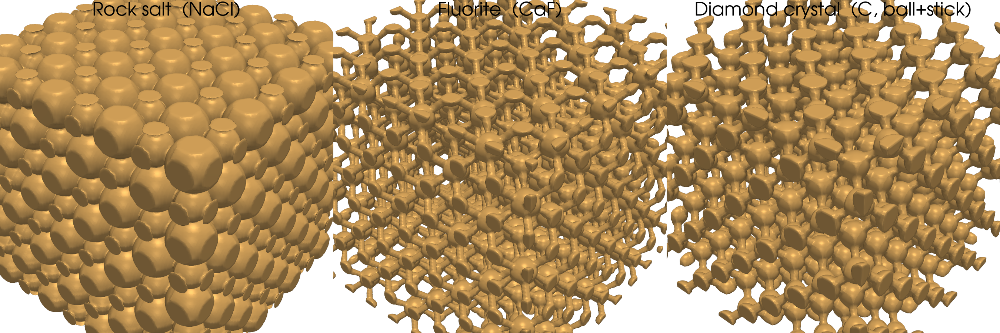
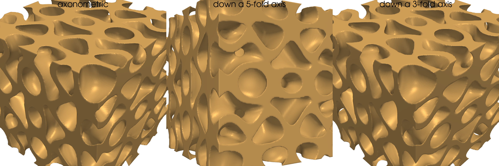
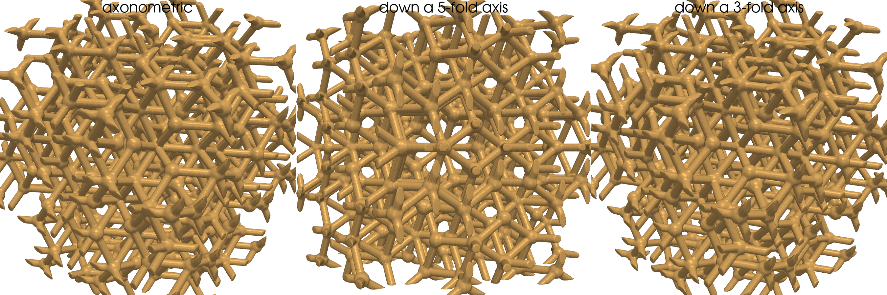
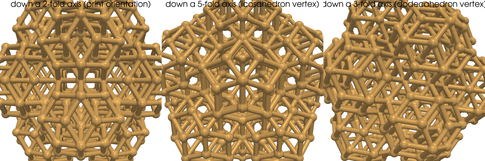

# Infill lattice cubes

Sixteen 40 mm cubes, each filled with a different mathematically
interesting periodic / aperiodic / fractal lattice and exported as an STL.
Generated implicitly: a scalar field is evaluated on a 160³ voxel grid,
intersected with the outer cube, and isosurfaced with marching cubes.


The three "atomic" crystals at higher resolution:



The two icosahedral quasicrystal variants, each viewed down its body
diagonal, a 5-fold axis, and a 3-fold axis:





The same quasicrystal lattice clipped to its natural icosahedral envelope
— a rhombic triacontahedron — instead of a cube. No edges get chopped
mid-strut; every cylinder runs full-length between two accepted
quasicrystal vertices. Top / bottom faces sit flat on the build plate.



| Cube | Family | Equation / construction |
|---|---|---|
| `gyroid_cube.stl`        | TPMS    | `sin x · cos y + sin y · cos z + sin z · cos x = 0`  (Schoen, 1970) |
| `schwarz_p_cube.stl`     | TPMS    | `cos x + cos y + cos z = 0`  (Schwarz, 1865) |
| `schwarz_d_cube.stl`     | TPMS    | `sin x sin y sin z + sin x cos y cos z + cos x sin y cos z + cos x cos y sin z = 0` |
| `neovius_cube.stl`       | TPMS    | `3(cos x + cos y + cos z) + 4 cos x cos y cos z = 0` |
| `iwp_cube.stl`           | TPMS    | `2(cos x cos y + cos y cos z + cos z cos x) − (cos 2x + cos 2y + cos 2z) = 0`  (Schoen I-WP) |
| `lidinoid_cube.stl`      | TPMS    | Lidin's TPMS — a single-sheet surface in the gyroid family |
| `bcc_cube.stl`             | strut   | Body-centred cubic: 8 struts from cell centre to each corner |
| `fcc_cube.stl`             | strut   | Face-centred cubic: every corner → its 3 nearest face centres |
| `octet_cube.stl`           | strut   | Buckminster Fuller's octet truss: FCC + central octahedron |
| `diamond_cubic_cube.stl`   | strut   | Diamond/silicon crystal: two FCC sub-lattices with tetrahedral bonds |
| `rock_salt_cube.stl`       | crystal | NaCl ionic crystal: alternating Na+ / Cl- on a half-cell sub-lattice (two interpenetrating FCC, 6-coordinated) |
| `fluorite_cube.stl`        | crystal | CaF₂ ball-and-stick: Ca²⁺ on FCC + F⁻ at all 8 tetrahedral interstices, 8 Ca-F bonds per Ca |
| `diamond_crystal_cube.stl` | crystal | Carbon diamond ball-and-stick: 8 C atoms per cell sp³-bonded along a√3⁄4 with the classic 109.47° tetrahedral angle |
| `quasicrystal_cube.stl`         | quasi | 3-D icosahedral quasicrystal (density-wave form): F(r) = Σᵢ cos(k aᵢ · r) over the 6 five-fold axes — aperiodic, with full icosahedral point-group symmetry |
| `quasicrystal_lattice_cube.stl` | quasi | 3-D icosahedral quasicrystal (cut-and-project vertices + edges): projection of ℤ⁶ through the icosahedral physical/internal subspaces, drawn as ball-and-stick |
| `menger_cube.stl`          | fractal | Menger sponge at recursion depth 3 (20³ = 8 000 retained sub-cubes) |

In every TPMS the surface is thickened to a printable sheet by
`|F(x,y,z)| < t`; the threshold `t` is tuned per surface so each cube has
roughly the same volume fraction (≈ 30 %).

## Build

```bash
# default: every lattice at 40 mm cube, 10 mm cell, 200³ grid
./run.sh infill_lattices/make_lattice_cubes.py

# pick a subset, or tune
./run.sh infill_lattices/make_lattice_cubes.py \
    --lattices gyroid octet menger \
    --cube-mm 50 --cell-mm 12.5 --resolution 240
```

Output STLs land in `infill_lattices/stl/` (gitignored). A grid-of-renders
contact sheet is produced separately via:

```bash
./run.sh infill_lattices/render_contact_sheet.py
```

## Notes on the math

**Triply-periodic minimal surfaces (TPMS).** Each TPMS is a minimal
surface (mean curvature 0 everywhere) that is invariant under a 3-D
crystallographic translation group. Schwarz gave the first five examples
in 1865; Alan Schoen rediscovered the family in a 1970 NASA report and
added the gyroid, I-WP, and others. Because the implicit form `F = 0`
already partitions space into two interpenetrating labyrinths, thickening
to `|F| < t` gives a single-walled solid that is automatically watertight
and self-supporting — which is why TPMS infill has become a favourite of
both topology-optimisation and 3-D-printing communities.

**Strut lattices.** The four cubic strut families realise the four most
symmetric Bravais point-graphs:

* `bcc` — lowest connectivity (8), bending-dominated, very compliant.
* `fcc` — 12-coordinated like close-packed metals.
* `octet` — stretching-dominated, the canonical "best" stiffness-to-mass
  isotropic lattice (Deshpande, Fleck & Ashby, 2001).
* `diamond_cubic` — only 4-coordinated, the actual atomic graph of
  diamond and silicon; produces an open, gem-like lattice.

**Atomic crystals.** Three real-material crystal structures rendered with
atoms as spheres and (where covalent / coordinated) explicit bonds as
cylinders:

* `rock_salt` (NaCl) — the textbook ionic crystal. Na⁺ and Cl⁻ occupy
  alternating vertices of a simple-cubic grid of period `c/2`; one
  species's sub-lattice is FCC and the other is its `(c/2, 0, 0)` offset.
  Six opposite-type nearest neighbours per ion at distance `c/2`. Radii
  here (≈ 0.21 c, 0.30 c) leave a thin overlap so the cube prints as one
  connected piece.
* `fluorite` (CaF₂) — the prototype AX₂ structure. Ca²⁺ on FCC, F⁻ at all
  eight tetrahedral interstices `(c/4, c/4, c/4)·{1, 3}³`. Drawn here as
  ball-and-stick (16 Ca–F bonds per cell, each of length `a√3⁄4`) so the
  atoms can be small enough to read individually.
* `diamond_crystal` — the iconic covalent crystal. Two interpenetrating
  FCC sub-lattices of C atoms offset by `(c/4, c/4, c/4)`; every atom is
  sp³-bonded to its four tetrahedral neighbours at the 109.47° angle.
  Same connectivity as the `diamond_cubic` strut lattice but with the
  atoms drawn as spheres as well.

The strut and crystal categories share a "compute the SDF over one unit
cell at sub-grid resolution and tile it" pipeline; the cube boundary is
phase-shifted by `c/4` for crystals so it falls between atoms rather than
slicing them in half.

**Icosahedral quasicrystals.** The aperiodic outliers of the set, both
based on the 6 five-fold axes of the icosahedron. They share the same
icosahedral point group `Iₕ` (6 five-fold + 10 three-fold + 15 two-fold
axes) but realise it in two complementary ways:

*Density-wave form (`quasicrystal`).* A continuous scalar field built as

```
F(r) = Σᵢ₌₁..₆ cos(k · aᵢ · r)
```

where the six unit vectors `aᵢ` are the 5-fold axes of an icosahedron —
the six antipodal vertex pairs of the standard `(±1, ±φ, 0)` icosahedron,
with `φ = (1 + √5) / 2` the golden ratio. Because the irrational ratios
between the axes' Cartesian components are mutually incommensurate, `F`
has **no period along any direction in ℝ³** and the thickened sheet
`|F| < t` is the simplest density-wave model of real materials like
Al-Mn, Al-Cu-Fe, and Cd-Yb icosahedral quasicrystals (Shechtman, 1984).
The same field with the rational Fibonacci convergents `1, 2, 3/2, 5/3,
8/5, …` substituted for φ would collapse to a periodic 1/1, 2/1, 3/2, …
"approximant" crystal — using the true irrational φ keeps it permanently
aperiodic.

*Cut-and-project form (`quasicrystal_lattice`).* The discrete vertex
graph of the same icosahedral quasicrystal — what you'd draw as the
ball-and-stick model. Built by projecting the 6-D simple-cubic integer
lattice `ℤ⁶` through two complementary 3-D subspaces:

* `P∥` — the *physical* subspace, whose basis vectors are the 6 five-fold
  axes `(1, φ, 0)` and cyclic permutations.
* `P⊥` — the *internal* subspace, obtained by replacing `φ` with its
  algebraic conjugate `σ = −1/φ = (1 − √5)/2` in `ℚ(√5)`.

A 6-D point `n ∈ ℤ⁶` is accepted as a vertex iff its internal projection
`P⊥ · n` lies inside an *acceptance window* (a sphere here — a less
canonical but icosahedrally-symmetric stand-in for the rhombic
triacontahedron `W = P⊥ · [0, 1]⁶` used in the strict construction).
Two vertices are joined by an edge iff their 6-D pre-images differ by
`±eᵢ` for some basis direction. This is the Elser / Levine-Steinhardt /
Cahn-Shechtman-Gratias construction; rendered as spheres + cylinders it
yields the iconic 3-D Penrose / Ammann tiling of prolate + oblate golden
rhombohedra, with no two vertex environments locally identical anywhere
in the cube.

**Menger sponge.** A degree-3 self-similar fractal: at each level every
remaining sub-cube is divided into 3³ pieces and the 7 pieces that touch
the centre on two-or-more axes are removed. At level *n* the sponge has
`20ⁿ` retained sub-cubes, a Hausdorff dimension of
`log 20 / log 3 ≈ 2.7268`, and an interior surface area that diverges as
`n → ∞`.

## The natural icosahedral envelope: a rhombic triacontahedron

A cube is a *terrible* container for an icosahedrally-symmetric lattice:
its symmetry group (Oₕ, 48 elements) doesn't share a 5-fold axis with
the lattice (Iₕ, 120 elements), so the cube faces inevitably slice
through random struts. The natural container is a **rhombic
triacontahedron** — the unique convex polyhedron that is

* the projection of the unit 6-cube ``[0, 1]⁶`` through the same ``P‖``
  matrix we use to project the 6-D lattice into physical space (so the
  triacontahedron is *literally* the physical-space image of a single
  6-D unit cell),
* tiled by exactly 10 prolate + 10 oblate golden rhombohedra (the
  building blocks of Penrose's 3-D tiling),
* the shape into which real icosahedral quasicrystals like Cd-Yb and
  Cd-Ho actually grow grains in the lab, and
* of full icosahedral point-group symmetry Iₕ — the same as the lattice.

It has 30 congruent golden-rhombic faces, 60 edges, and 32 vertices
(12 with 5-fold valence + 20 with 3-fold valence). With unit face
normals the three characteristic radii are

| Radius                     | Formula                                    | × in-radius |
|----------------------------|--------------------------------------------|-------------|
| in-radius (⊥ to face)       | `r`                                        | 1.000       |
| 3-fold vertex distance     | `r · √3 / φ`                                | 1.0705      |
| 5-fold vertex (circumradius)| `r · √(2 + φ) / φ`                          | 1.1756      |

`infill_lattices/make_quasicrystal_triacontahedron.py` generates this
envelope:

```bash
./run.sh infill_lattices/make_quasicrystal_triacontahedron.py
# defaults: 22 mm in-radius, 6 mm edge, 1.1/0.6 mm radii, 200³ grid
```

The pipeline enumerates the same cut-and-project lattice in a generous
bounding cube, then keeps only the vertices that fall inside the
triacontahedron *and only the edges whose **both** endpoints survive*.
Because the cube enclosure is gone, the marching-cubes mesh has no
slicing-plane caps and every strut joins two vertex spheres
end-to-end. Two of the 30 face normals are ±Z, so the part sits flat
on a rhombic face for FDM printing (same 2-fold lattice axis as the
cube version → identical 0° / 31.7° / 58.3° edge-angle distribution).

## Printing the cut-and-project quasicrystal on a Bambu (no supports)

The `quasicrystal_lattice` is tuned to print on a Bambu Lab FDM printer
in its natural axis-aligned orientation (cube sitting on its `−Z` face)
without scaffolding. The six 5-fold axes split into three angle classes
relative to the print direction:

| Family                   | Angle from horizontal | How it prints                |
|--------------------------|-----------------------|------------------------------|
| `(±1, ±φ, 0)` ×2 axes    | 0° (horizontal)       | 6 mm bridge (well under Bambu's ~10 mm comfort range) |
| `(±φ, 0, ±1)` ×2 axes    | 31.7° (`arctan 1/φ`)  | self-supporting strut       |
| `(0, ±1, ±φ)` ×2 axes    | 58.3° (`arctan φ`)    | self-supporting strut       |

With the default `vertex_radius = 1.1 mm`, `edge_radius = 0.605 mm`, and
a 0.2 mm layer height, the self-support cone has half-angle
`arctan(0.2 / 0.605) ≈ 18.3°` — comfortably below the 31.7° edges. The
generator prints a printability report (target layer height,
self-supporting count, bridge count, unprintable count) on every
`quasicrystal_lattice` run, and post-processes the mesh to drop boundary
fragments that the cube clip leaves disconnected (those would not stick
to the build plate).

Recommended Bambu Studio settings:

* layer height ≤ 0.2 mm (0.16 mm is safer if your slicer's bridge mode
  isn't aggressive)
* nozzle ≤ 0.4 mm (default)
* enable **bridging detection** so the horizontal-axis edges are sliced
  as bridges with the higher fan and bridge flow
* add a 5 mm brim — the cube's bottom face only contacts the build plate
  at the small disks where vertices/edges cross `z = −20 mm`, so the
  brim significantly helps adhesion
* tree / organic supports OFF, `Support material` OFF

## Implementation

Everything goes through the same pipeline:

```
implicit scalar field  →  ∩ outer cube (max of SDFs)
                       →  skimage.measure.marching_cubes
                       →  trimesh: drop scrap components,
                          dedupe + repair faces, fix normals
                       →  STL
```

Strut SDFs are computed by folding query points into one unit cell and
checking the 27 candidate neighbour shifts `{−c, 0, +c}³`, which is
sufficient because every strut is fully contained in its unit cell.

## Tuning

| Flag | What it does |
|---|---|
| `--cube-mm`         | outer cube side (default 40) |
| `--cell-mm`         | unit cell period for TPMS / strut lattices (default 10) |
| `--strut-radius-mm` | rod radius for strut lattices (default 1.1) |
| `--tpms-threshold`  | override the per-surface `|F|<t` threshold |
| `--menger-level`    | Menger recursion depth (default 3; level 4 ≈ 160 k holes) |
| `--resolution`      | voxels / axis for marching cubes (default 200) |
