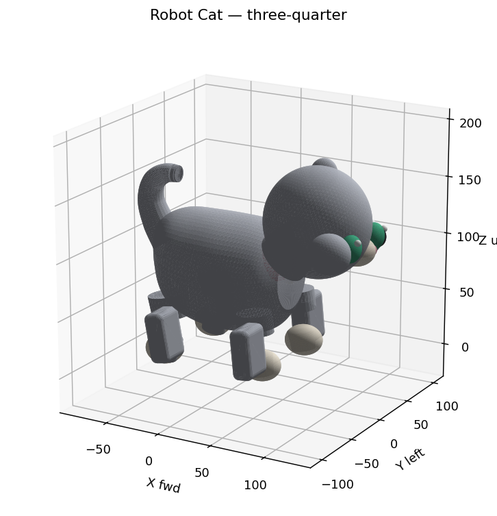
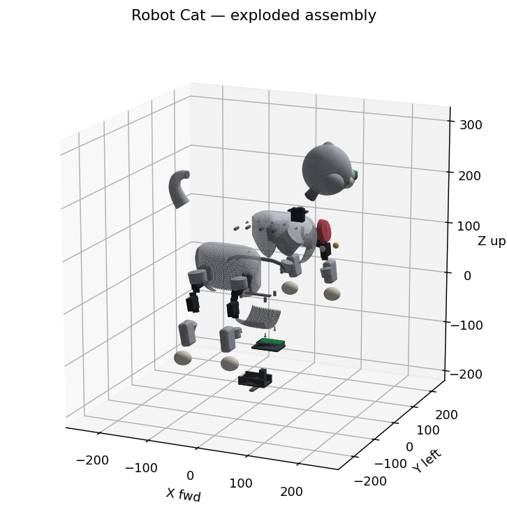
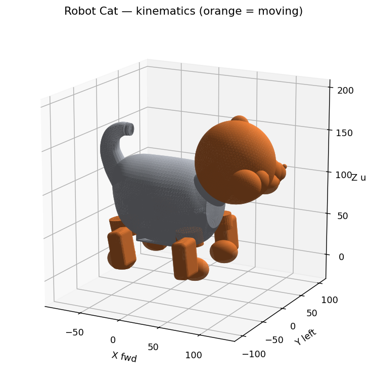
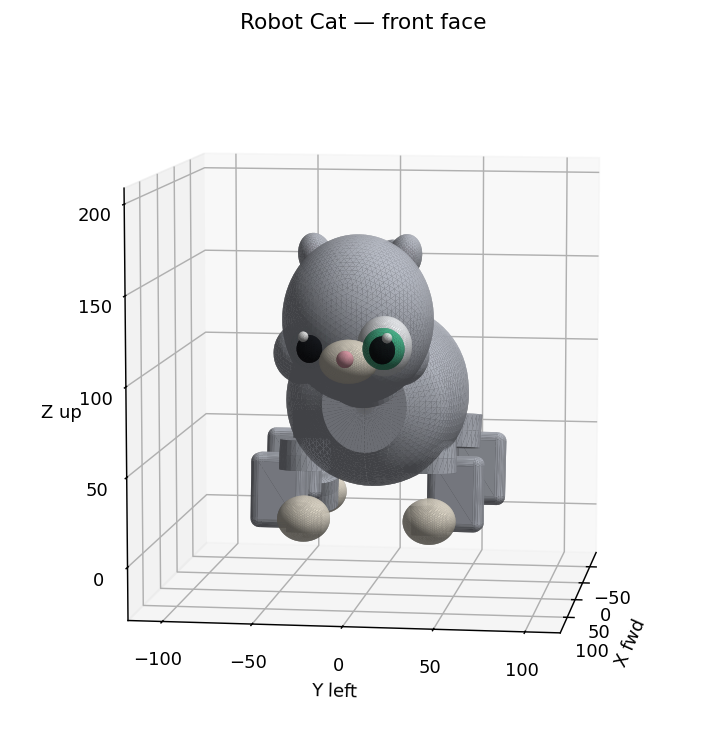
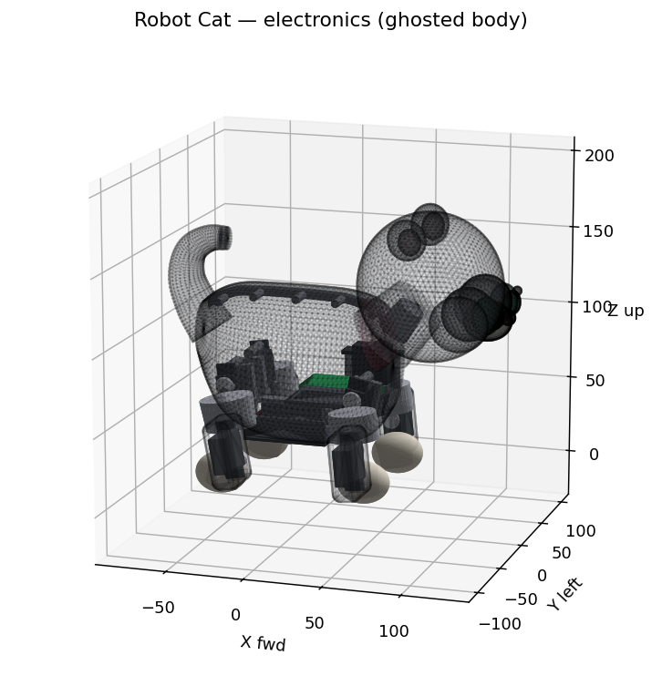
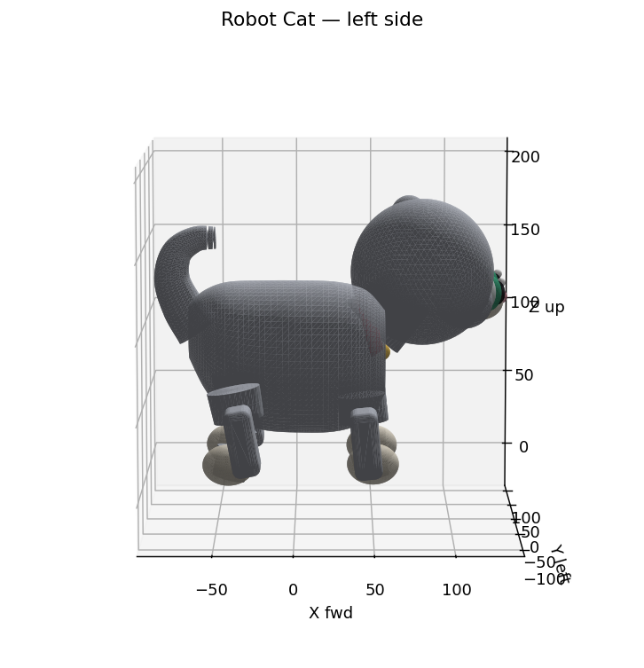

# Robot Cat 🐈 — a cat-like quadruped BuildViz build

A procedurally-generated **robot cat**: a small, **cute** quadruped kitten whose
proportions follow the neotenic ("baby-schema") cuteness recipe, but whose
mechanism is a **sane, buildable** design modelled on the proven open-source
robot cat **Petoi Nybble** — **9 real micro servos** (8 legs at 2 DOF each + 1
neck pan), a **passive rigid spine**, and a **passive tail** (see
[§2](#2-drivetrain--why-9-servos-petoi-nybblebittle-class) and [`BOM.md`](BOM.md)).
The deliverable is a complete
[BuildViz](../hexapod_walker/prototype_sts3215/BUILDVIZ.md) build (mesh STLs +
`scene.json` + `design_spec.yaml`) generated by `build_cat.py`.

> **Rev 10 — baby KITTEN proportions (+ a tail bugfix).** Rev 8/9 read as a small
> *adult* cat; rev 10 pushes the proportions to peak neoteny so it's unmistakably a
> **kitten**: an even **bigger, domed head** (head ≈ ½ the body), **bigger/rounder
> eyes** set lower and wider, a **shorter, rounder pot-belly body** lifted a touch
> so it clears the legs, **shorter stubbier legs** sat further outboard with
> **oversized paws**, **softer round ears**, and a **shorter, softly-curled tail**.
> It also **fixes the "detached tail" bug**: the old tail lofted 7 control points
> through a sharp ~90° hook tapering to a 3.2 mm spike, so the loft self-intersected
> and the tip read as detached; it's now a **Catmull-Rom-smoothed, densely-ringed
> continuous curl** (max per-segment turn 6°, stubby 7 mm tip) rooted 15 mm into the
> rump (**tail↔body surface gap 0.04 mm**). All of rev 9's manufacturability is
> preserved. **~591 g**, CoM (23, 0, 73) mm, **27 mm** inside the support polygon.
>
> **Rev 9 — manufacturable (a real screw-together printed assembly).** Rev 8
> nailed the cute look but the body was a single solid shell you couldn't print,
> open, or mount hardware in. Rev 9 fixes that **without changing the silhouette**:
> the chubby body is **split on the sagittal plane** into `shell_left` +
> `shell_right` (seam hidden along the spine/belly midline, 0.2 mm print
> clearance) with a removable **belly hatch** for electronics service; the **head
> prints separately** and mounts on the neck servo. It gains real **M2 self-tap
> screw bosses** along the seam, an **alignment lip**, a **hatch frame**, and
> integral **servo / board / battery mounts**. Every part is tagged **MOVING vs
> STATIC** (see [§6](#6-what-moves--kinematics-9-dof)) and there's an
> **exploded-view** render. See [§7](#7-manufacturing--printable-screw-together-parts-rev-9).
>
> **Rev 8 — cuteness redesign.** Revs 6–7 were a full-size adult cat on big 60 g
> STS3215 servos that read as hunched and spindly. Rev 8 chases **neoteny** on a
> Petoi-Nybble-class **micro** platform: (1) **smaller hardware** — ~10 g micro
> metal-gear servos (~23×12×24 mm) instead of the 45×34 mm STS3215, and a compact
> **ESP32 board** instead of the 68 mm Arduino Uno Q; (2) a **big round head held
> UP** with **large forward eyes**, plump cheeks, a small pink nose, rounded ears;
> (3) a **compact, chubby, rounded body** (head:body ~1:2.6); (4) **short stubby
> legs** whose elbow/knee actuators hide inside a chubby **FUR knee bulge**; (5)
> **hidden electronics** + a **coral collar + gold bell**.






---

## 1. How cats move — research findings

These findings (from feline-anatomy and quadruped-robotics literature) drove
every design decision below.

### Skeletal proportions & leg structure (digitigrade)
- Cats are **digitigrade**: they stand and walk on their **toes (phalanges)**
  with the rest of the foot lifted, unlike plantigrade humans who put the whole
  sole down. This elongates the limb and adds spring, which is why digitigrade
  animals move quickly.
- The bone that looks like a hind-leg "backward knee" is **not** a knee — it's
  the **heel (calcaneus)** at the **hock (ankle/tarsus)**, set high in the limb.
  The true knee (**stifle**) sits **high and close to the body**.
- **Hind-limb joint chain (the feline zig-zag):** hip → **femur** (down &
  *forward* to the high stifle) → **stifle/knee** → **tibia/shank** (down &
  *backward*) → **hock** (the prominent *backward*-pointing heel) →
  **metatarsus** (down & forward, elevated) → **digitigrade toe paw**.
- **Front-limb joint chain:** scapula/shoulder → **humerus** (down & *backward*,
  so the **elbow points back**) → **forearm** (down & forward) → **carpus/wrist**
  → metacarpus → toe paw. Front legs are straighter and act more in support /
  braking; hind legs are the propulsive zig-zag.

### The flexible spring spine
- A cat's spine is exceptionally flexible. During fast locomotion it
  **flexes and extends like a spring**, behaving as a *kinematic extension of
  the legs*: spinal flexion/extension increases effective leg length and
  **lengthens stride**, and stores/releases elastic energy in the back muscles
  and aponeurosis. Cheetahs (and house cats) gallop with two distinct flights —
  **gathered** (spine flexed, limbs tucked) and **extended** (spine extended,
  limbs reaching) — which is *the* speed trick of felids. Scapula motion adds
  to stride length too.

### Gaits & the tail
- **Walk:** lateral-sequence, four-beat, symmetrical — each hind footfall is
  followed by the ipsilateral fore (RH → RF → LH → LF). Cats place the hind paw
  almost in the fore print.
- **Trot:** two-beat, diagonal couplets (e.g. left-fore + right-hind strike
  together) — efficient cruising.
- **Gallop / (half-)bound:** asymmetrical four-beat with a **suspension** phase;
  the spine compresses and extends to maximize stride. Domestic cats often
  **half-bound** (both hind feet land nearly together).
- The **long tail** is a counterbalance / inertial tail used for mid-air
  righting and balance in fast turns.

### Cuteness research — neoteny + cute robot pets (rev 8)
"Cute" is not vague; it's the well-studied **baby-schema / Kindchenschema** (Konrad
Lorenz; Glocker 2009; Borgi 2014). The traits humans read as adorable: a **large
head** relative to the body, a **high domed forehead**, **large eyes set LOW**
(below the skull mid-line) and **wide apart**, a **small nose/mouth**, **round
chubby cheeks**, **short thick limbs**, and an **overall rounded** body with no
sharp angles. Concrete rules applied here:

| Cue | Rule applied (rev 10 = baby-kitten extreme) |
|---|---|
| Head:body ratio | head ~92 mm on a ~126 mm body ≈ **1:1.4** of the chest→tail length, head ≈ **½ body** — a big domed kitten head (rev 8/9 was a smaller head) |
| Eyes | **bigger** (~33 mm), **forward-facing**, set ~11 mm **below** head centre, **wider** apart, iris fills most of the eye, with a tiny **catch-light** sparkle |
| Nose/mouth | small (~9 mm) pink nose, no harsh mouth |
| Cheeks | **extra-plump** rounded cheeks (chubby-cheek cue) |
| Ears | **soft round** ears (low-aspect ellipsoids), not sharp triangles |
| Body | short, chubby, near-circular **pot-belly** sections (rounded barrel) |
| Limbs | **shorter, stubbier**, thick, **oversized** rounded paws |
| Tail | short, stubby, softly **curled** over the back |
| Posture | head held **up** and forward (alert/friendly), not ducked |

**Robot-pet references:** **Petoi Nybble** (open-source robot cat: 11 joints,
~10–13 g micro servos, NyBoard/BiBoard, ~250 mm, ~320 g) is the size/hardware
template; **MarsCat** (16 servos, OLED eyes, ~2 kg) and **Sony Aibo ERS-1000**
(22 actuators, OLED eyes, fluid rounded curves) prove that **big expressive eyes
+ rounded forms** are the cuteness engine — earlier angular robots read
"Terminator," rounded ones read "adorable."

### Scale used (rev 10)
- A **compact BABY kitten**: **~227 mm** bounding box (nose-to-tail-curl, shorter
  than rev 8/9's ~253 mm), **~68 mm** hip pivot, **~591 g**, with a wider ±40 mm
  paw track. *Small + plump is part of cute* — the earlier "make it bigger" rev-6
  goal was about fitting the Uno Q + torque, but cuteness matters more here, so the
  cat shrinks/rounds and the controller shrinks with it.

### How real quadruped robots map this
- Large dynamic quadrupeds (MIT Cheetah, Unitree, Boston Dynamics **Spot**) use
  **3 DOF per leg** (12 total): **HAA** (hip abduction), **HFE** (hip flexion),
  **KFE** (knee). That extra abduction DOF buys lateral balance and turning, at
  the cost of two more servos per leg.
- **Small hobby quadrupeds that actually walk** — the open-source **Petoi
  Nybble** (cat) and **Bittle** (dog) — drop abduction and use just **2 DOF per
  leg in the sagittal plane** plus **1 neck servo** (≈9 servos), with a
  **passive spine and tail**. Bittle (~280 g) walks, trots and carries ~450 g on
  this layout.
- **This build follows the Petoi pattern** (see §2): it's the honest,
  buildable choice for a small robot cat. The 3-DOF-per-leg + actuated-spine
  approach of the earlier 16-servo revision was over-built and not practically
  walkable at this scale.

---

## 2. Drivetrain — why 9 servos (Petoi Nybble/Bittle class)

The proven open-source robot cats **Petoi Nybble** and **Bittle** walk reliably
on **2 actuated DOF per leg in the sagittal plane** (shoulder/hip pitch +
elbow/knee pitch), an **un-actuated spine**, and a **passive tail** — 8 leg
servos + 1 neck pan = **9 servos**. This build copies that proven layout.

| Group | Joints (axis) | Servos | Notes |
|---|---|---|---|
| **Front leg** ×2 | shoulder **pitch** (Y) + elbow **pitch** (Y) | 2 each → 4 | planar; elbow points back |
| **Hind leg** ×2 | hip **pitch** (Y) + knee **pitch** (Y) | 2 each → 4 | planar; high forward stifle |
| **Neck** | head **pan** (Z) | 1 | head aiming (Bittle's 9th servo) |
| **Spine** | — *passive, rigid fused trunk* | 0 | no spine servos |
| **Tail** | — *passive decorative taper* | 0 | no tail servo |
| **Total** | | **9 servos** | down from rev 3's 16 |

**No hip abduction servos** → the legs swing purely fore/aft and there is no
chunky 2-DOF hip case-stack. All leg hinges share the lateral (Y) axis.

### Why a micro servo (rev 8, for cuteness)
The full-size **STS3215** (45 × 34 mm, 60 g) is what forced revs 6–7's spindly
legs and clunky external knee boxes. Cute needs **small**, so rev 8 drops to a
**~10 g micro metal-gear serial servo** (~23 × 12 × 24 mm, ~0.29 N·m) — the
actuator class Petoi's cute Nybble actually uses. At the light ~591 g kitten it
still clears the torque target (with extra room — rev 10's shorter legs shorten
the moment arm):

| Servo | Stall | Standing margin | Trot margin | Verdict |
|---|---|---|---|---|
| **Micro metal-gear** (chosen) | **0.29 N·m** | **5.4×** | **2.7×** | small **and** strong enough |
| FEETECH STS3215 (revs 6–7) | 2.94 N·m | huge | huge | too big → un-cute |

Small enough that the elbow/knee actuator **hides inside a chubby leg** and the
hip/shoulder actuator **hides inside the body** — no external hardware shows.

---

## 3. Real actuators, all hidden (micro servos)

Every powered joint is a real **micro metal-gear serial servo** modelled at its
true envelope: case **~23 × 12 × 24 mm**, **~11 g**, stall **~0.29 N·m**, small
disc horn. There are **9** (8 leg + 1 neck) — and **none of them shows from the
outside**:

- **Hip / shoulder servos** mount **inboard** on the inner chassis; the leg root
  sits just inside the body wall, so the chubby torso shell completely **covers
  the servo** (it lives in the belly/haunch cavity). From outside you see only
  the cat's body and the leg emerging from under it.
- **Elbow / knee servos** sit at the joint but are wrapped in a small, smooth
  **FUR-coloured `knee` bulge** (a filleted rounded box sized to the servo case
  + ~2.8 mm). Each reads as a **chubby joint, not a black box** (4 of them).
- **Neck servo** tucks into the chest and is hidden by the **collar**.

**Per-joint assembly:** *fixed segment / chassis → micro servo → disc horn →
moving segment seated on the horn*. Bones are trimmed at each joint so they butt
the servo/horn (gap-free, overlap-free); rev 10 trims the lower bone ~13 mm below
the elbow/knee so its root tucks under the knee cover instead of poking the
chubby belly, and the legs sit further outboard so they emerge from the lower
sides of the round body.

Drive-system part types:

- **9 `micro_servo`** (`role: motor`, dark slate) — 8 leg + 1 neck, all hidden.
- **9 `servo_horn`** (`role: horn`, light grey) — one per servo.
- **4 `knee`** (`role: limb`, FUR) — smooth bulges covering the elbow/knee servos.
- **1 `collar`** (coral) + **1 `bell`** (gold) — hide the neck joint + wiring.

Full part list, fastener sizes/counts, mass, cost and load assessment in
[`BOM.md`](BOM.md).

### Feasibility — stands (numbers, this build)
- **Static stability:** estimated total **~591 g**, CoM at (23, 0, 72.8) mm
  projects **27 mm inside** the 4-paw support polygon `[(-42,±40), (50,±36)]` →
  stable stance even with the big kitten head forward (battery low + aft balances it).
- **Torque:** knee moment arm 37 mm (shorter stubby legs); micro-servo 0.29 N·m
  stall → **5.4× margin standing**, **2.7× at trot** — clears the ≥3× standing /
  ≥1.5× trot target with room.
- **Gait:** the 92 × 80 mm support polygon permits a **statically-stable crawl**;
  short stubby legs trade stride length for adorableness.
- **Limits:** position servos + passive spine + short legs ⇒ good for standing,
  posing and a slow static walk. **No trot/gallop/bound/jump at speed.**

### No interpenetration, and nothing hovers
Two independent audits prove buildability:
- **`check_overlaps.py`** (solid-intersection volume): **0 mm³ unexpected
  overlap**. Remaining contacts are intended (split shell halves + hatch + neck
  **mating** at the seam, foot↔lower-leg bond, one-piece head features,
  limb-root↔shell, **knee-cover↔bone/paw**, head/tail↔shell, collar↔neck,
  electronics↔cavity).
- **`check_assembly.py`** (nearest-surface gap + connected components): the robot
  is **one connected component** (all 75 parts touch within 2 mm), **0 hovering
  parts**, all 4 paws on z = 0.

---

## 4. Electronics & power — hidden in the belly

**Short answer: tucked low inside the belly, fully hidden.** Because a cute,
compact body can't fit the 68 mm **Arduino Uno Q** used in revs 6–7 without
bloating, rev 8 switches to a **compact ESP32 quadruped board**
(NyBoard / BiBoard-class, **~46 × 30 × 9 mm**, ~16 g) — exactly what a
Nybble-class robot cat runs. It mounts low in the chest cavity at ≈ **(24, 0, 62)
mm** on a printed tray. The **small 2S LiPo** (7.4 V ~450 mAh, ~46 × 28 × 12 mm,
~32 g) rests **low and ~centred in the belly** at ≈ **(−8, 0, 37) mm** on a
printed cradle whose floor now **bridges down to the inner belly wall** (the
rev-10 belly is deeper, so the cradle floor auto-extends to keep the cluster
touching the shell).

**Why there (CoM/balance):** the battery is the heaviest single item, placed low
to keep the center of mass low and between the four legs. With the battery +
board placed, the CoM is **(23, 0, 72.8) mm** — **27 mm inside** the 4-paw
support polygon. The cradle (with a **retainer strap**) carries a riser to the
controller tray (on **4 M2 standoffs**) so the whole electronics cluster is **one
connected, hidden chassis** touching the body, accessible via the **belly hatch**.

> **Fit — still easy.** The Nybble-class board + 2S LiPo sit in the rounder kitten
> belly with room to spare (the deeper pot-belly gives even more vertical room);
> nothing shows from outside.

**Wiring:** the 9 micro servos run from the board's servo bus — a drop to each
shoulder/hip servo, a jumper to that leg's knee servo; the neck servo taps the
front and is hidden by the **collar**.

Modelled parts: `controller` (ESP32 board, green), `controller_tray` +
`battery_cradle` (dark-grey printed mounts), `battery` (dark red). See the
**electronics-reveal render** (`renders/cat_electronics.png`, body ghosted) and
[`BOM.md`](BOM.md).



---

## 5. Cute-shaped body (one continuous chubby barrel)

The trunk is **one continuously-lofted shell** (the spine is not actuated): a
single mesh swept through Catmull-Rom-smoothed, **near-circular** cross-sections,
giving a **short, chubby, rounded pot-belly body** — a plump barrel, not a hunched
teardrop. The big domed **head is held up and forward** on a short thick neck, the
**tail** is a short stubby **soft curl** over the back (rev 10 rebuilt it as one
continuous densely-ringed loft so the tip no longer looks detached), and a **coral
collar + gold bell** ring the neck. The face is where the cute lives: **two big
forward green eyes** (white + iris + pupil + a catch-light sparkle), a **small pink
nose**, **extra-plump cheeks**, and **soft round ears**.




---

## 6. What moves — kinematics (9 DOF)

**Short answer: the head pans, and each of the four legs bends at two joints —
nothing else moves.** The spine and tail are rigid structure. The 9 servos drive
9 articulated joints; every scene instance is tagged `role` + a `moving` boolean
so the viewer can tell moving parts from static structure (orange vs grey in
`renders/cat_kinematics.png`).

| # | Joint | Servo | Axis | Range | Parent (static-ish) | Child (moves with it) |
|---|---|---|---|---|---|---|
| J1 | neck pan | neck_pan | **Z** | ±60° | chest shell | head + face + `head_mount` |
| J2 | L shoulder pitch | L_shoulder | **Y** | ±45° | `shell_left` | L upper_arm → forearm → paw (+elbow servo) |
| J3 | R shoulder pitch | R_shoulder | **Y** | ±45° | `shell_right` | R upper_arm → forearm → paw |
| J4 | L elbow pitch | L_elbow | **Y** | 0–110° | L upper_arm | L forearm + paw + knee-cover |
| J5 | R elbow pitch | R_elbow | **Y** | 0–110° | R upper_arm | R forearm + paw + knee-cover |
| J6 | L hip pitch | L_hip | **Y** | ±45° | `shell_left` | L femur → shank → paw (+knee servo) |
| J7 | R hip pitch | R_hip | **Y** | ±45° | `shell_right` | R femur → shank → paw |
| J8 | L knee pitch | L_knee | **Y** | 0–110° | L femur | L shank + paw + knee-cover |
| J9 | R knee pitch | R_knee | **Y** | 0–110° | R femur | R shank + paw + knee-cover |

- **MOVING:** head + all face features + `head_mount`; every leg segment
  (`upper_arm`, `forearm`, `femur`, `shank`), paws, FUR `knee` covers, servo horns.
- **STATIC structure:** `shell_left`/`shell_right`, `belly_hatch`, `neck`, servo
  **bodies**, `servo_mount` brackets, seam bosses/lip, hatch frame, the
  electronics + their mounts, the collar/bell, and the (rigid) tail.
- Note the **elbow/knee servo travels with its upper segment** — it's body-mounted
  only at the shoulder/hip; the distal servo rides the limb it sits on.

Ranges above are software limits (the geared position servos can travel further);
the spine has **0 DOF** (the shell is structural) and the tail is a passive curl.

---

## 7. Manufacturing — printable, screw-together parts (rev 9)

Rev 8's body was a single solid shell — not actually printable or openable.
Rev 9 re-architects it as a real assembly (see the **exploded render** above):

**Split scheme — sagittal (left/right).** The chubby body is cut on the **Y = 0
plane** into `shell_left` + `shell_right`. The seam falls on the **dorsal spine +
ventral midline** (both naturally hidden, so the cute silhouette is intact), each
half prints **dome-up on its flat seam face** with minimal support, and opening
the halves exposes the whole servo/electronics bay. A **0.2 mm clearance** is left
at the seam (a real print fit, not a floating gap).

**Access — belly hatch.** A removable underside panel (`belly_hatch`, footprint
x ∈ [−32, 28] mm) drops into a printed `hatch_frame` over the electronics bay, so
the **LiPo + ESP32 install/service without splitting the shell**.

**Head.** Prints as its own piece; a printed `head_mount` socket grips the neck
column / neck-servo horn so it bolts onto the driven neck.

**Fasteners (M2 self-tap into printed bosses):**

| Fastener | Count | Into |
|---|---|---|
| M2 self-tap, seam | **7** | `seam_bosses` (straddle Y=0, pull the halves together) |
| M2 self-tap, hatch | **4** | `hatch_frame` corner bosses |
| (servo + board screws per datasheet) | ~22 | servo tabs / board standoffs |

M2 **self-tapping screws into printed bosses** are the standard at this scale (no
heat-set inserts needed; **M2 brass heat-set inserts** are an optional upgrade for
repeated service).

**Alignment.** A `seam_lip` tongue runs the dorsal seam on the inner wall so the
halves register and can't shear; the seam bosses straddle the plane.

**Internal hardware mounts (integral to the print):**
- **`servo_mount` ×5** — a backing rib + 2 screw bosses under each body/neck
  servo's mounting tabs (shoulder ×2, hip ×2, neck). The **4 elbow/knee servos**
  are captured inside their **FUR `knee` covers** (the cover *is* the housing).
- **`controller_tray` + 4 `board_standoffs`** carry the ESP32 board.
- **`battery_cradle` + `battery_strap`** hold the LiPo; the cradle riser ties to
  the tray so the electronics are one connected, hidden, serviceable cluster.

**Legs** are already separate articulating printed segments that bolt to their
servo horns (`upper_arm`/`forearm`/`front_paw`, `femur`/`shank`/`hind_paw`, plus
the `knee` cover that opens to seat the elbow/knee servo).

### Assembly sequence
1. **Print** ~35 parts (shell halves, belly hatch, neck, head + ears, tail, collar
   + bell, 8 leg bones, 4 paws, 4 knee covers, 5 servo mounts, tray/cradle/strap,
   head mount).
2. **Seat the 9 micro servos:** shoulder/hip/neck servos into their `servo_mount`
   brackets inside the shell halves; elbow/knee servos into the knee covers.
3. **Build the legs:** bolt each bone to its servo horn; close the knee covers.
4. **Mount electronics:** ESP32 board onto the tray standoffs; LiPo into the
   cradle under the strap; route the servo bus through the open belly.
5. **Join the halves:** register `shell_left`+`shell_right` on the seam lip and
   drive the **7 seam screws** into the seam bosses.
6. **Close up:** fit `belly_hatch` (4 screws), press the head onto the neck via
   `head_mount`, clip on the collar + bell.

---

## 8. Part breakdown

Coordinate frame: **+X forward (nose)**, **+Y left**, **+Z up**, millimetres,
lifted so the paws sit at **z = 0**. **75 instances total** (~35 distinct printed
bodies):

- **Body shell (4, `role: shell`):** `shell_left`, `shell_right`, `belly_hatch`,
  `neck` — the split, screw-together body.
- **Head (17):** `head`, 2× `cheek`, `muzzle`, `nose`, 2× `ear`, 2× `ear_inner`,
  2× `eye_white`, 2× `iris`, 2× `pupil`, 2× `eye_gleam` (face molded on the head).
- **Tail (1):** `tail_segment` — one smooth passive taper in a short soft curl
  (51-ring Catmull-Rom loft; rooted 15 mm into the rump).
- **Front legs (2×3 + 2 knees):** `upper_arm`, `forearm`, `front_paw`, `knee`.
- **Hind legs (2×3 + 2 knees):** `femur`, `shank`, `hind_paw`, `knee`.
- **Accessory (2):** `collar` + `bell`.
- **Drive system (18):** 9 `micro_servo` + 9 `servo_horn` (all hidden).
- **Manufacturing features (10):** 5× `servo_mount`, `seam_bosses`, `seam_lip` +
  `hatch_frame` (=2 `hatch_frame`), `head_mount`, `board_standoffs`.
- **Electronics + fasteners (8):** `controller` (ESP32), `controller_tray`,
  `battery`, `battery_cradle`, `battery_strap`, `shell_screws`, `hatch_screws`.

Overall bounding box **227 × 141 × 179 mm**; **~99 g of servos** (9 × 11 g) + ~48 g
electronics/battery + ~430 g hollow-print PLA = **~591 g total**, roughly $60–90 in
actuators + board + battery + ~$2 in M2 screws. Cute palette: soft light-grey fur,
cream muzzle/paws, pink nose + inner ears, **big green eyes**, coral collar + gold
bell, with hidden drive-system parts (slate servos, grey horns), interior mounts
(grey) and electronics (green board, dark-red LiPo). Full numbers in
[`cat_viz/design_spec.yaml`](cat_viz/design_spec.yaml) and [`BOM.md`](BOM.md).

---

## 9. Files

```
robot_cat/
├── build_cat.py            # trimesh generator: writes stl/*.stl + scene.json
├── render_cat.py           # matplotlib offscreen multi-angle screenshots
├── check_overlaps.py       # pairwise solid-intersection overlap sanity check
├── check_assembly.py       # connectivity/gap audit: nothing hovers, one body
├── BOM.md                  # bill of materials (servos, brackets, fasteners, mass, cost)
├── README.md               # this file
├── renders/                # cat_side/iso/front/top + cat_electronics + cat_exploded + cat_kinematics
└── cat_viz/                # the BuildViz build (single hub build id: robot-cat)
    ├── meta.json           # BuildViz project/build/version record (default + versions)
    ├── scene.json          # DEFAULT version "main" (live tip): meshes + instances
    ├── design_spec.yaml    # design intent (kinematics, manufacturing, biomechanics, dims)
    ├── stl/                # one STL per part (baked into world coords)
    └── versions/           # frozen, immutable named versions (BuildViz-native)
        ├── v5/ … v9/       #   earlier frozen revisions
        └── v10/            #   scene.json + design_spec.yaml + stl/ (this rev)
```

The robot cat is **one** BuildViz build (`robot-cat`) with **named versions**
(`main` = live tip, plus frozen `v5`–`v10`) — BuildViz's intended way to keep
history of one evolving design. See [`VERSIONS.md`](VERSIONS.md).

---

## 10. Regenerate & view

Regenerate the STLs + `scene.json` (uses the repo's shared `.venv` with
`trimesh`/`numpy`):

```sh
./run.sh robot_cat/build_cat.py
```

Check for part overlaps and hovering, and re-render the verification screenshots:

```sh
./run.sh robot_cat/check_overlaps.py
./run.sh robot_cat/check_assembly.py
./run.sh robot_cat/render_cat.py
```

View it in BuildViz:

```sh
npx buildviz robot_cat/cat_viz --port 5174
```

### Versioning (freezing a revision)

The robot cat is a **single** BuildViz build, `robot-cat`, with **named
versions** — the way BuildViz is designed to keep history of one evolving design
(*not* a separate build id per revision). The live working tip is the default
version `main` (the build root `cat_viz/scene.json`); frozen revisions live at
`cat_viz/versions/<name>/`. `REV` at the top of `build_cat.py` just sets the
revision number (it flows into the self-describing `scene.json` name).

A plain build rewrites the live tip (`main`); to **freeze the current build as an
immutable named version** `cat_viz/versions/v<REV>/`:

```sh
./run.sh robot_cat/build_cat.py            # write the live tip (main)
./run.sh robot_cat/build_cat.py --freeze   # freeze it as v<REV> (immutable)
#   --freeze v9   pick a name        --force   replace an existing frozen version
```

`--freeze` is the local equivalent of `buildviz push --version v<REV>
--set-default`: it copies `cat_viz/` into `versions/v<REV>/` and updates
`meta.json`; it does **not** create a separate hub build id. The hub serves the
new version live under `…/?build=robot-cat&version=v<REV>`. See
[`VERSIONS.md`](VERSIONS.md) for the full scheme, the per-version table, and the
BuildViz design note this workflow is based on.

Validate the build (run from the build dir):

```sh
cd robot_cat/cat_viz && npx buildviz validate . --json
```

> The `buildviz` CLI is the local package at `/Users/lbiewald/buildviz`; if
> `npx buildviz` can't find it, run it from there
> (`cd /Users/lbiewald/buildviz && node bin/buildviz.mjs validate <path> --json`).
